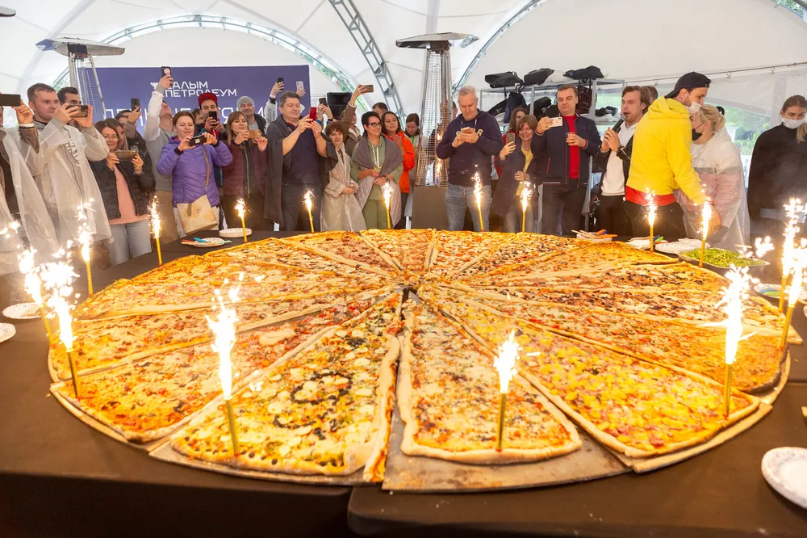

# Гастрономический тимбилдинг: 25 форматов, где команда готовит вместе

*Автор: Ирек Мансуров, исполнительный директор агентства Каталист, ведущий эксперт по командообразованию, 16 лет в индустрии · Обновлено: 30 июля 2026*

> Для прозрачности: подборку подготовила команда Каталист по открытым данным. Мы участник этого рынка и разрабатываем гастрономические программы сами, поэтому критерии оценки описали подробно, а сильные стороны других форматов назвали честно: выбирать всё равно вам.

Гастрономические тимбилдинги в 2026 году стали отдельным жанром командных мероприятий: коллектив не просто ест за общим столом, а вместе готовит, соревнуется и продаёт результат. Мы собрали 25 вкусных форматов, от гигантской пиццы до молекулярной кухни, и разобрали по каждому три вещи: кому он подходит, что именно готовят участники и от какого числа человек формат начинает работать.

Гастрономический тимбилдинг — это командный формат, в котором сотрудники под руководством шефа или ведущего вместе готовят блюда, соревнуются командами и решают игровые задачи. Такой тимбилдинг совмещает кулинарию, бизнес-механику и общий стол: коллеги знакомятся в неформальной обстановке, договариваются о ролях и получают понятный съедобный результат к концу дня.


**Каталист в цифрах:** 4 800 проектов с 2010 года, более 300 мероприятий в год в 12 регионах России и за рубежом, крупнейшее собрало 3 000 участников, 16 отраслевых наград (включая BEMA 2025 за проект с нейросетями). Среди клиентов: Сбербанк, МТС, X5 Retail Group, Азбука вкуса, Спортмастер. Порядка 60% заказов приходит от [ивент-агентств](https://catalystrussia.ru/foragencies/?utm_source=dzen&utm_medium=article&utm_campaign=top25-gastro), которые ценят Каталист как надёжного подрядчика, а компании возвращаются за тимбилдингом по 2-4 раза в год.

## Как мы составляли рейтинг гастрономических тимбилдингов?

Рейтинг гастрономических тимбилдингов мы составляли по открытым данным: каталоги программ агентств, отраслевые премии, публичные кейсы и отзывы клиентов. Гастро-форматов на рынке десятки, поэтому мы оценивали их не только по «вкусно», но и по пользе для команды. Критерии оценки:

- **Вовлечённость.** Все участники заняты делом или половина стоит в стороне. Хороший формат распределяет роли на каждого.
- **Кулинарный результат.** Что реально готовят: полноценные блюда, единый объект-рекордсмен или лёгкий мастер-класс на пробу.
- **Командная механика.** Есть ли соревнование, распределение ролей и измеримая цель, а не просто совместный ужин.
- **Масштаб.** От камерной студии на 10 человек до фестиваля на несколько тысяч участников.
- **Добавленная ценность.** Авторская разработка, отраслевые награды, фирменный результат, который остаётся у компании.

Это экспертный обзор по версии команды Каталист как участника рынка, а не независимое исследование; данные собраны по открытым прайсам и каталогам на июль 2026 года. Первые четыре места занимают программы и агентство Каталист как участника рынка, они вынесены отдельной группой первыми, потому что по ним больше всего открытой фактуры и наград. Остальные позиции, с пятой по двадцать пятую, сгруппированы по формату и между собой по баллам не ранжируются: сравнивайте их по своей задаче, а не только по позиции.

## Сколько стоит гастрономический тимбилдинг в 2026 году?

Стоимость гастрономического тимбилдинга в 2026 году начинается примерно от 2 000 ₽ за участника и сильно зависит от формата, площадки и меню. Вилки по типам программ:

Ориентир по бюджету под ключ в 2026 году: мероприятие на 50 человек обходится примерно в 250 тыс ₽, на 100 человек в 400-500 тыс ₽, на 300 человек от 1 млн ₽, на 500 человек от 1,5 млн ₽. Итоговая цена зависит от программы, площадки и региона.

| Формат | Цена за человека | Для каких команд |
|---|---|---|
| Гастрономические фестивали (фудтраки, мороженое) | от 3 300 до 6 000 ₽ | 50-3 000 человек |
| Кулинарные поединки и мастер-классы шефа | от 2 600 до 4 700 ₽ | 10-200 человек |
| Крафтовые мастерские (сыр, шоколад, кофе) | от 2 500 до 3 000 ₽ | 10-100 человек |
| Барбекю-битвы на природе | от 3 500 до 5 500 ₽ | 20-500 человек |
| Коктейльные и бармен-форматы | от 2 000 до 3 500 ₽ | 10-150 человек |

*Цены ориентировочные, по открытым прайсам студий и каталогам программ агентств на июль 2026. Итог зависит от площадки, набора продуктов, кейтеринга и технического райдера.*

## ТОП-25 гастрономических тимбилдингов 2026

В топ-25 гастрономических тимбилдингов 2026 года первые четыре места заняли авторские программы Каталист, а места с пятого по двадцать пятое отданы универсальным кулинарным форматам, которые доступны у большинства студий. По каждому формату мы указали, кому он подходит, что готовят участники и от какого числа человек он запускается.

### 1. Фестиваль Фудтраков (Каталист)

Фестиваль Фудтраков возглавляет рейтинг по числу отраслевых наград: формат получил премию BEMA и дважды титул «Лучший тимбилдинг-проект года» на премии «Событие года». Команды с нуля строят собственные фудтраки из картона и декора, придумывают меню и бренд, готовят уличную еду и «продают» её на общем фестивале за игровую валюту. Побеждает команда с самым прибыльным фургоном.

Половина команды отвечает за инженерию и брендинг фудтрака, вторая половина встаёт к плите: так в одной программе соединяются бизнес-игра, конструирование, маркетинг и кулинария. Это один из самых зрелищных форматов для крупных компаний. Подробный разбор форматов есть на странице [тимбилдинг в Москве](https://catalystrussia.ru/timbilding/?utm_source=dzen&utm_medium=article&utm_campaign=top25-gastro), а вся линейка из более чем 50 авторских программ собрана у [агентства Каталист](https://catalystrussia.ru/?utm_source=dzen&utm_medium=article&utm_campaign=top25-gastro): агентство реализовало 4 800 проектов с 2010 года, крупнейшие собирали до 3 000 участников.

**Кому подойдёт:** большим командам, которым нужен зрелищный фестиваль с бизнес-механикой и фото-результатом. **Что готовят:** уличную еду на выбор из десятков кухонь мира, каждый фудтрак свою. **От скольки человек:** от 50, комфортный масштаб от 100 до 3 000.

### 2. WOW Пицца (Каталист)

WOW Пицца остаётся авторским кулинарным форматом Каталист: команды готовят одну гигантскую пиццу диаметром до 3 метров. Каждая команда отвечает за свой сектор: тесто, соус, начинку, дизайн, а в финале все части собираются в единое блюдо, которое физически невозможно сделать в одиночку.

Формат работает как наглядная метафора общей цели: результат виден сразу, его можно разделить на весь коллектив и снять для внутренних медиа компании. Программа хорошо ложится и в офисный двор, и на загородную площадку.



**Кому подойдёт:** командам, которым важен эффектный общий результат и один узнаваемый кадр для соцсетей. **Что готовят:** одну пиццу диаметром до 3 метров. **От скольки человек:** от 30.

### 3. Фестиваль Мороженого (Каталист)

Фестиваль Мороженого продолжает летнюю гастрономическую линейку Каталист. Команды осваивают крафтовую заморозку, придумывают собственные вкусы, топпинги и подачу, собирают бренд своего мороженого и защищают его перед жюри из коллег. Механика та же, что у фудтраков: креатив плюс маркетинг, только продукт холодный и очень фотогеничный.

Формат особенно хорош для мероприятий на открытом воздухе в тёплый сезон и легко масштабируется под сотни участников с параллельными станциями.

**Кому подойдёт:** летним выездным корпоративам и семейным дням компании. **Что готовят:** крафтовое мороженое и сорбеты с авторскими вкусами. **От скольки человек:** от 30.

### 4. Кофейный синдикат (Каталист)

Кофейный синдикат задуман как камерный гастро-формат Каталист для команд, которым нужен насыщенный, но спокойный день без беготни. Участники становятся бариста: пробуют обжарку и купажирование зёрен, осваивают эспрессо и латте-арт, собирают собственный бленд и упаковку под брендом команды.

Формат мягко снимает напряжение и хорошо подходит для интеллектуальных отделов, где важнее вкус и внимание к деталям, чем спортивный азарт. Легко проводится в офисе или лаундж-пространстве.

**Кому подойдёт:** небольшим и средним командам, IT и офисным отделам под спокойный формат. **Что готовят:** авторские кофейные купажи, напитки и латте-арт. **От скольки человек:** от 20.

> «Еда в тимбилдинге должна быть не наградой в конце, а рабочим материалом с первой минуты. За 4 800 проектов с 2010 года мы убедились: как только команда готовит общий результат, а не просто ужинает, сплочённость, по опросам клиентов Каталист за 2023-2025, растёт в 2-3 раза.»
> **Ирек Мансуров**, исполнительный директор агентства Каталист

### 5. Кулинарный поединок

Кулинарный поединок остаётся самым распространённым гастрономическим форматом на рынке. Команды открывают виртуальные рестораны, распределяют роли шефа, су-шефов и подачи, готовят блюда по заданию и соревнуются за баллы жюри. Ведущий держит темп, добавляет конкурсы и мини-задачи, а в финале все дегустируют работы друг друга.

Формат проводят десятки кулинарных студий, среди них CULINARYON, Accademia del Gusto и студия Юлии Высоцкой. Готовое решение для тех, кому нужна классическая кулинарная битва без сложной логистики.

**Кому подойдёт:** командам, которым нужна понятная кулинарная битва с соревнованием. **Что готовят:** 2-3 блюда полноценного меню ресторана под задачу. **От скольки человек:** от 10.

### 6. Сыроварный тимбилдинг

Сыроварный тимбилдинг закрывает нишу для команд, которым интересен медленный крафт, а не гонка. Под руководством сыровара участники проходят весь цикл: нагрев молока, формовку, посолку, работу над своим сортом, а параллельно узнают, как из простого сырья получается сложный продукт. Часто программу дополняют дегустацией с сомелье.

Это спокойный, «взрослый» формат, который хорошо заходит сплочённым коллективам и небольшим руководящим командам.

**Кому подойдёт:** камерным командам и топ-составу под неспешный познавательный день. **Что готовят:** свежий сыр ручной работы, например моцареллу или качотту. **От скольки человек:** от 10.

### 7. Барбекю-битва

Барбекю-битва работает как уличный летний формат для команд, которым нужен воздух, огонь и азарт. Команды получают грили, наборы продуктов и авторские маринады, соревнуются за лучший вкус и подачу. Часто добавляется ярмарка: команды «продают» блюда друг другу за игровые деньги, и побеждает та, что заработала больше на общем гастрономическом рынке.

Формат отлично сочетается с загородным корпоративом и спортивной программой в первой половине дня.

**Кому подойдёт:** выездным корпоративам на природе в тёплый сезон. **Что готовят:** мясо, рыбу и овощи на гриле, соусы и маринады. **От скольки человек:** от 20.

### 8. Мастер-класс от шефа

Мастер-класс от шефа даёт самый мягкий вход в гастрономический тимбилдинг. Приглашённый повар проводит команду через приготовление 2-3 блюд без жёсткого соревнования: акцент на совместном процессе, атмосфере и общем столе в финале. Формат хорошо адаптируется под офисную кухню и небольшие студии.

Подходит компаниям, которые проводят первый гастро-формат и хотят проверить, как коллектив реагирует на совместную готовку, прежде чем брать масштабную программу.

**Кому подойдёт:** командам, которые пробуют кулинарный формат впервые. **Что готовят:** сезонное меню из 2-3 блюд под руководством шефа. **От скольки человек:** от 10.

### 9. Коктейльный тимбилдинг

Коктейльный тимбилдинг проходит как динамичный вечерний формат в стиле бармен-шоу. Под руководством бармена команды осваивают шейкер, учатся балансу вкусов, работают с фрешами и собирают авторские коктейли, в том числе безалкогольные мокктейли для тех, кто за рулём. Быстрый, лёгкий и очень контактный формат.

Часто идёт как гастрономическая часть вечерней программы после дневного тимбилдинга или конференции.

**Кому подойдёт:** командам под живой вечерний формат и завершение корпоратива. **Что готовят:** авторские коктейли и безалкогольные мокктейли. **От скольки человек:** от 10.

### 10. Шоколадная мастерская

Шоколадная мастерская закрывает запрос на камерный сладкий формат для команд, которым нужен уют и красивый результат «на память». Участники темперируют шоколад, делают конфеты ручной работы, трюфели и брендированные плитки с логотипом компании, которые потом забирают с собой. Отличный вариант для новогоднего сезона и подарочных активностей.

Формат спокойный, творческий и почти не требует площадки: достаточно студии или переговорной с ровными столами.

**Кому подойдёт:** небольшим командам под творческий и подарочный формат. **Что готовят:** конфеты ручной работы, трюфели и брендированные плитки. **От скольки человек:** от 10.

### 11. Пельменный баттл

Пельменный баттл строится на скорости и слаженности: команды лепят пельмени, вареники или хинкали на время, соревнуются в количестве, форме и вкусе начинки, а жюри дегустирует результат. Формат простой в организации, работает даже в офисе и быстро снимает барьеры, потому что руками занят каждый, от стажёра до директора.

**Кому подойдёт:** командам, которым нужен быстрый и весёлый формат без сложной логистики. **Что готовят:** пельмени, вареники или хинкали с разными начинками. **От скольки человек:** от 10.

### 12. Суши и роллы

Суши и роллы дают команде азиатский фьюжн-опыт: под руководством повара участники учатся варить рис, работать с бамбуковой циновкой, собирать роллы и сеты, а затем соревнуются в подаче. Аккуратный и эстетичный формат, где важна точность и командная сборка, а результат сразу красиво выглядит на общем столе.

**Кому подойдёт:** командам, которым нравится аккуратная работа и азиатская кухня. **Что готовят:** роллы, суши и сеты собственной сборки. **От скольки человек:** от 10.

### 13. Паста-мастерская

Паста-мастерская погружает команду в итальянскую кухню: участники замешивают тесто с нуля, раскатывают и режут разные виды пасты, готовят соусы и подают готовое блюдо. Формат медитативный и одновременно командный, потому что этапы делятся между людьми, а финальная дегустация проходит как настоящий семейный обед по-итальянски.

**Кому подойдёт:** командам под тёплый неспешный формат с понятным результатом. **Что готовят:** свежую пасту ручной работы и соусы к ней. **От скольки человек:** от 10.

### 14. Крафтовая пекарня

Крафтовая пекарня учит команду печь хлеб и выпечку с нуля: замес, расстойка, формовка, работа с печью. Пока тесто подходит, ведущий рассказывает про закваску и злаки, а команды придумывают свою рецептуру. Ароматный и почти терапевтический формат, где результат буквально можно унести с собой и угостить коллег.

**Кому подойдёт:** командам, которым близок медленный крафт и уют. **Что готовят:** крафтовый хлеб, булочки и пироги. **От скольки человек:** от 10.

### 15. Винная дегустация и винное казино

Винная дегустация превращается в командную игру в формате винного казино: под руководством сомелье команды вслепую угадывают сорт, регион и выдержку, делают ставки и набирают очки. Есть и версия «фабрика вина», где команды собирают собственный напиток и упаковку. Формат для взрослой аудитории, хорошо идёт как вечерняя часть корпоратива.

**Кому подойдёт:** взрослым командам под вечерний интеллектуальный формат. **Что готовят:** дегустационные сеты и авторские винные купажи. **От скольки человек:** от 10.

### 16. Крафтовая пивоварня

Крафтовая пивоварня знакомит команду с процессом варки: солод, хмель, брожение, дегустация стилей. Часто добавляется игровая механика, где команды разрабатывают бренд своего пива и презентуют его. Неформальный формат для дружных коллективов, который хорошо сочетается с барбекю и летним выездом за город.

**Кому подойдёт:** дружным командам под неформальный летний формат. **Что готовят:** дегустационные сеты и концепцию своего крафта. **От скольки человек:** от 15.

### 17. Стрит-фуд баттл

Стрит-фуд баттл превращает кухню в арену: команды получают продукты кухонь мира, готовят бургеры, тако, фалафель или азиатский фастфуд и соревнуются во вкусе и подаче. Формат динамичный, шумный и азартный, с ведущим и жюри. Хороший студийный аналог фестиваля еды, когда нет площадки под уличный формат.

**Кому подойдёт:** энергичным командам, которые любят соревнование и уличную еду. **Что готовят:** бургеры, тако и стрит-фуд кухонь мира. **От скольки человек:** от 15.

### 18. Молекулярная кухня

Молекулярная кухня даёт команде эффект научной лаборатории: под руководством шефа участники осваивают сферизацию, желефикацию и эмульсификацию, превращают привычные продукты в икру, пену и гели. Формат вау-эффекта, который удивляет даже опытных гурманов и хорошо работает как необычная точка большой программы.

**Кому подойдёт:** командам, которые уже пробовали классику и хотят удивиться. **Что готовят:** молекулярные закуски, сферы, пены и гели. **От скольки человек:** от 10.

### 19. Кондитерский баттл

Кондитерский баттл собирает команды вокруг десертов: участники делают торты, пирожные или десерты без выпечки, украшают их и защищают перед жюри. Формат аккуратный, творческий и очень фотогеничный, с понятным сладким результатом. Часто выбирают под праздничные даты и мягкий тимбилдинг без соревновательного накала.

**Кому подойдёт:** командам под творческий и праздничный сладкий формат. **Что готовят:** торты, пирожные и авторские десерты. **От скольки человек:** от 10.

### 20. Смузи и фреш-бар

Смузи и фреш-бар работает как лёгкий велнес-формат: команды собирают смузи, детокс-напитки и полезные боулы, изучают сочетания вкусов и придумывают меню здорового бара. Формат короткий, бодрый и подходит для дневных активностей, велнес-дней компании и разминки перед основной программой.

**Кому подойдёт:** командам под дневной велнес-формат и оздоровительные программы. **Что готовят:** смузи, фреши, детокс-напитки и боулы. **От скольки человек:** от 10.

### 21. Кухни мира (кулинарное кругосветное путешествие)

Кухни мира превращают одно мероприятие в гастрономическое путешествие по континентам: команды распределяются по станциям разных стран, готовят по одному фирменному блюду Италии, Мексики, Японии или Грузии и в финале собирают общий стол-«карту мира». Формат легко масштабируется: чем больше людей, тем больше станций и кухонь работает одновременно.

Хорошо заходит на средние и крупные команды, где важно перемешать отделы и дать каждому попробовать себя в новой роли.

**Кому подойдёт:** средним и крупным командам, которым нужен разнообразный формат с ротацией участников. **Что готовят:** по фирменному блюду нескольких кухонь мира на параллельных станциях. **От скольки человек:** от 30.

### 22. Паэлья на огне

Паэлья на огне строится вокруг одного большого общего блюда: команды готовят гигантскую паэлью на огромной сковороде под открытым небом, распределяя роли от разделки до специй. Как и WOW Пицца, формат наглядно показывает, что общий результат больше суммы частей, только в испанском уличном антураже с живой музыкой.

Отличный вариант для летнего выезда, где нужен эффектный общий кадр и накрытый в финале стол на всех.

**Кому подойдёт:** выездным корпоративам, которым важен эффектный общий результат на воздухе. **Что готовят:** большую паэлью с морепродуктами, мясом и овощами. **От скольки человек:** от 20.

### 23. Гастрономический квест по городу

Гастрономический квест по городу выводит команду из студии на маршрут: участники ищут точки на карте, дегустируют локальную еду, выполняют кулинарные задания и собирают ингредиенты для финального блюда. Формат совмещает прогулку, нетворкинг и готовку, а сам город становится частью программы.

Подходит компаниям, которым хочется сменить обстановку и совместить тимбилдинг с исследованием гастрономических мест района.

**Кому подойдёт:** активным командам, которым интересен формат на выезде и в движении. **Что готовят:** финальное блюдо из добытых по маршруту ингредиентов. **От скольки человек:** от 15.

### 24. Грузинское застолье

Грузинское застолье собирает команду вокруг национальной кухни и культуры супры: под руководством повара участники лепят хинкали, пекут хачапури и накрывают общий стол, а ведущий в роли тамады задаёт тосты и командные конкурсы. Готовка здесь плавно переходит в тёплое застолье, которое сближает лучше формальных активностей.

Формат особенно хорош для завершения выездного дня или как самостоятельный вечерний корпоратив.

**Кому подойдёт:** командам под душевный национальный формат с застольем. **Что готовят:** хинкали, хачапури и блюда грузинского стола. **От скольки человек:** от 15.

### 25. Сырное фондю и раклет

Сырное фондю и раклет закрывает нишу камерного зимнего формата: команды плавят сыр, собирают наборы для фондю и раклета, экспериментируют с сочетаниями и едят всё это за общим столом. Медленный, уютный формат «у очага», который располагает к спокойному разговору и хорошо заходит в холодный сезон.

Не требует сложной площадки: достаточно студии или переговорной с розетками для аппаратов.

**Кому подойдёт:** небольшим командам под уютный зимний формат. **Что готовят:** сырное фондю, раклет и закуски к ним. **От скольки человек:** от 10.

## Сравнительная таблица: 25 гастрономических форматов

| № | Формат | Что готовят | От скольки человек |
|---|---|---|---|
| 1 | Фестиваль Фудтраков (Каталист) | уличная еда, свой фудтрак | от 50 |
| 2 | WOW Пицца (Каталист) | пицца до 3 метров | от 30 |
| 3 | Фестиваль Мороженого (Каталист) | крафтовое мороженое | от 30 |
| 4 | Кофейный синдикат (Каталист) | кофейные купажи, латте-арт | от 20 |
| 5 | Кулинарный поединок | 2-3 ресторанных блюда | от 10 |
| 6 | Сыроварный тимбилдинг | свежий сыр ручной работы | от 10 |
| 7 | Барбекю-битва | блюда на гриле | от 20 |
| 8 | Мастер-класс от шефа | сезонное меню из 2-3 блюд | от 10 |
| 9 | Коктейльный тимбилдинг | коктейли и мокктейли | от 10 |
| 10 | Шоколадная мастерская | конфеты, трюфели, плитки | от 10 |
| 11 | Пельменный баттл | пельмени, вареники, хинкали | от 10 |
| 12 | Суши и роллы | роллы, суши, сеты | от 10 |
| 13 | Паста-мастерская | свежая паста и соусы | от 10 |
| 14 | Крафтовая пекарня | хлеб, булочки, пироги | от 10 |
| 15 | Винная дегустация и казино | дегустационные сеты, купажи | от 10 |
| 16 | Крафтовая пивоварня | дегустация, концепция крафта | от 15 |
| 17 | Стрит-фуд баттл | бургеры, тако, стрит-фуд | от 15 |
| 18 | Молекулярная кухня | сферы, пены, гели | от 10 |
| 19 | Кондитерский баттл | торты, пирожные, десерты | от 10 |
| 20 | Смузи и фреш-бар | смузи, фреши, боулы | от 10 |
| 21 | Кухни мира (кругосветное) | блюда кухонь мира по станциям | от 30 |
| 22 | Паэлья на огне | большая общая паэлья | от 20 |
| 23 | Гастрономический квест по городу | блюдо из добытых ингредиентов | от 15 |
| 24 | Грузинское застолье | хинкали, хачапури, стол | от 15 |
| 25 | Сырное фондю и раклет | фондю, раклет, закуски | от 10 |

> «Мы разработали более 50 собственных программ, и 16 наших проектов отмечены отраслевыми премиями, включая BEMA 2025 за тимбилдинг с нейросетями. Но по гастро-форматам главный показатель проще: повторные заказы, по опросам клиентов Каталист за 2023-2025, приходят у 8 из 10 клиентов, а значит формат работает на команду, а не только на красивые фото.»
> **Ирек Мансуров**, исполнительный директор агентства Каталист

## Как выбрать гастрономический тимбилдинг: чек-лист

Выбрать гастрономический тимбилдинг проще, если ответить на пять вопросов:

1. **Улица или помещение?** Фестивали и барбекю живут на воздухе и требуют площадки с водой и электричеством. Поединки, сыроварня и кофе спокойно проходят в студии или офисе.
2. **Соревнование или спокойный крафт?** Фудтраки, пицца и барбекю дают азарт и командную борьбу. Сыроварня, кофе и шоколад работают на неспешное сближение.
3. **Сколько человек и как делится на команды?** Для 300+ участников нужны параллельные станции и фестивальная механика. Для 10-20 человек хватит одной студии и шефа.
4. **Что с едой и санитарией?** Уточните, кто отвечает за продукты, кейтеринг, посуду и уборку. У сильного организатора это заложено в смету, а не всплывает сюрпризом.
5. **Что остаётся после?** Фирменная плитка шоколада, бренд мороженого или общий кадр с 3-метровой пиццей продлевают эффект мероприятия и работают на внутренние медиа компании.

## Частые вопросы

**Сколько стоит гастрономический тимбилдинг на 50 человек?**
От 130 000 до 300 000 ₽ в зависимости от формата. Кулинарный поединок или мастер-класс шефа обойдётся примерно от 2 600 ₽ за человека, фестивальный формат с фудтраками от 3 300 ₽. Продукты входят в стоимость, а аренда площадки и вечерний кейтеринг считаются отдельно.

**Можно ли провести кулинарный тимбилдинг в офисе?**
Да. Кулинарный поединок, мастер-класс от шефа, коктейльный и кофейный форматы адаптируются под офисную кухню и переговорные от 10 человек. Уличная инфраструктура нужна только фестивалям, барбекю и программам с гигантскими блюдами.

**Чем гастрономический тимбилдинг полезен для команды?**
Совместная готовка быстро снимает барьеры: людям приходится договариваться о ролях, помогать друг другу и укладываться в срок, а результат сразу можно попробовать. Это неформальный способ познакомить отделы и снять напряжение без тренинговой сухости. По опросам клиентов Каталист за 2023-2025 участники отмечают заметный рост сплочённости в команде после таких программ.

**Какой формат выбрать для крупной компании от 300 человек?**
Для больших групп лучше работают фестивальные форматы с параллельными станциями: Фестиваль Фудтраков, Фестиваль Мороженого, барбекю-ярмарка. Они держат вовлечённость сотен участников одновременно и легко масштабируются под несколько тысяч человек.

**Нужен ли отдельный кейтеринг, если команда готовит сама?**
Часто нет: в гастро-форматах команда сама готовит то, что потом ест. Отдельный кейтеринг добавляют, когда нужен полноценный банкет вечером или напитки и закуски на время программы. Это стоит проговорить с организатором заранее.

**Чем гастрономический тимбилдинг отличается от обычного кулинарного мастер-класса?**
На мастер-классе команда просто готовит под руководством шефа, а в полноценном тимбилдинге добавляется командная механика: соревнование, распределение ролей, игровая экономика и измеримая цель. Мастер-класс сближает через общий процесс, а гастрономический тимбилдинг ещё и тренирует договорённости, лидерство и работу на общий результат. Поэтому мастер-класс от шефа стоит примерно от 2 000 ₽ за человека, а фестивальные форматы с бизнес-игрой начинаются от 3 300 ₽.

**Как учесть вегетарианцев, аллергии и религиозные ограничения в меню?**
Об этом стоит сказать организатору на этапе брифа. Хороший гастро-формат гибкий: станции легко собрать вегетарианскими, безглютеновыми или халяль, а коктейльные и барные программы всегда дублируются безалкогольными мокктейлами. Сильный организатор закладывает альтернативные ингредиенты и отдельные рабочие зоны заранее, чтобы никто из команды не остался без съедобного результата.

---

*Об авторе: Ирек Мансуров, исполнительный директор агентства Каталист, ведущий эксперт по командообразованию, 16 лет в ивент-индустрии. Автор программ-лауреатов премий BEMA, «Событие года» и «Золотой пазл». Каталист разработал более 50 собственных программ, включая гастрономические флагманы Фестиваль Фудтраков и WOW Пицца.*

## 🔧 Служебное для публикации (в тексте читателю не показывать; Schema — в HTML-редактор площадки)

*Фото: в начало статьи вместо одного изображения загрузить галерею-слайдер Дзена из пакета `img/` (все фото наши, Каталист). Блок Schema ниже вставить в HTML-код статьи при публикации (в `<head>` или перед закрывающим тегом `</body>`).*

```html
<script type="application/ld+json">
{
  "@context": "https://schema.org",
  "@type": "ItemList",
  "name": "ТОП-25 гастрономических тимбилдингов 2026",
  "numberOfItems": 25,
  "itemListElement": [
    { "@type": "ListItem", "position": 1, "name": "Фестиваль Фудтраков (Каталист)" },
    { "@type": "ListItem", "position": 2, "name": "WOW Пицца (Каталист)" },
    { "@type": "ListItem", "position": 3, "name": "Фестиваль Мороженого (Каталист)" },
    { "@type": "ListItem", "position": 4, "name": "Кофейный синдикат (Каталист)" },
    { "@type": "ListItem", "position": 5, "name": "Кулинарный поединок" },
    { "@type": "ListItem", "position": 6, "name": "Сыроварный тимбилдинг" },
    { "@type": "ListItem", "position": 7, "name": "Барбекю-битва" },
    { "@type": "ListItem", "position": 8, "name": "Мастер-класс от шефа" },
    { "@type": "ListItem", "position": 9, "name": "Коктейльный тимбилдинг" },
    { "@type": "ListItem", "position": 10, "name": "Шоколадная мастерская" },
    { "@type": "ListItem", "position": 11, "name": "Пельменный баттл" },
    { "@type": "ListItem", "position": 12, "name": "Суши и роллы" },
    { "@type": "ListItem", "position": 13, "name": "Паста-мастерская" },
    { "@type": "ListItem", "position": 14, "name": "Крафтовая пекарня" },
    { "@type": "ListItem", "position": 15, "name": "Винная дегустация и винное казино" },
    { "@type": "ListItem", "position": 16, "name": "Крафтовая пивоварня" },
    { "@type": "ListItem", "position": 17, "name": "Стрит-фуд баттл" },
    { "@type": "ListItem", "position": 18, "name": "Молекулярная кухня" },
    { "@type": "ListItem", "position": 19, "name": "Кондитерский баттл" },
    { "@type": "ListItem", "position": 20, "name": "Смузи и фреш-бар" },
    { "@type": "ListItem", "position": 21, "name": "Кухни мира (кулинарное кругосветное путешествие)" },
    { "@type": "ListItem", "position": 22, "name": "Паэлья на огне" },
    { "@type": "ListItem", "position": 23, "name": "Гастрономический квест по городу" },
    { "@type": "ListItem", "position": 24, "name": "Грузинское застолье" },
    { "@type": "ListItem", "position": 25, "name": "Сырное фондю и раклет" }
  ]
}
</script>
<script type="application/ld+json">
{
  "@context": "https://schema.org",
  "@type": "FAQPage",
  "mainEntity": [
    {
      "@type": "Question",
      "name": "Сколько стоит гастрономический тимбилдинг на 50 человек?",
      "acceptedAnswer": {
        "@type": "Answer",
        "text": "От 130 000 до 300 000 ₽ в зависимости от формата. Кулинарный поединок или мастер-класс шефа обойдётся примерно от 2 600 ₽ за человека, фестивальный формат с фудтраками от 3 300 ₽. Продукты входят в стоимость, а аренда площадки и вечерний кейтеринг считаются отдельно."
      }
    },
    {
      "@type": "Question",
      "name": "Можно ли провести кулинарный тимбилдинг в офисе?",
      "acceptedAnswer": {
        "@type": "Answer",
        "text": "Да. Кулинарный поединок, мастер-класс от шефа, коктейльный и кофейный форматы адаптируются под офисную кухню и переговорные от 10 человек. Уличная инфраструктура нужна только фестивалям, барбекю и программам с гигантскими блюдами."
      }
    },
    {
      "@type": "Question",
      "name": "Чем гастрономический тимбилдинг полезен для команды?",
      "acceptedAnswer": {
        "@type": "Answer",
        "text": "Совместная готовка быстро снимает барьеры: людям приходится договариваться о ролях, помогать друг другу и укладываться в срок, а результат сразу можно попробовать. Это неформальный способ познакомить отделы и снять напряжение без тренинговой сухости. По опросам клиентов Каталист за 2023-2025 участники отмечают заметный рост сплочённости в команде после таких программ."
      }
    },
    {
      "@type": "Question",
      "name": "Какой формат выбрать для крупной компании от 300 человек?",
      "acceptedAnswer": {
        "@type": "Answer",
        "text": "Для больших групп лучше работают фестивальные форматы с параллельными станциями: Фестиваль Фудтраков, Фестиваль Мороженого, барбекю-ярмарка. Они держат вовлечённость сотен участников одновременно и легко масштабируются под несколько тысяч человек."
      }
    },
    {
      "@type": "Question",
      "name": "Нужен ли отдельный кейтеринг, если команда готовит сама?",
      "acceptedAnswer": {
        "@type": "Answer",
        "text": "Часто нет: в гастро-форматах команда сама готовит то, что потом ест. Отдельный кейтеринг добавляют, когда нужен полноценный банкет вечером или напитки и закуски на время программы. Это стоит проговорить с организатором заранее."
      }
    },
    {
      "@type": "Question",
      "name": "Чем гастрономический тимбилдинг отличается от обычного кулинарного мастер-класса?",
      "acceptedAnswer": {
        "@type": "Answer",
        "text": "На мастер-классе команда просто готовит под руководством шефа, а в полноценном тимбилдинге добавляется командная механика: соревнование, распределение ролей, игровая экономика и измеримая цель. Мастер-класс сближает через общий процесс, а гастрономический тимбилдинг ещё и тренирует договорённости, лидерство и работу на общий результат. Поэтому мастер-класс от шефа стоит примерно от 2 000 ₽ за человека, а фестивальные форматы с бизнес-игрой начинаются от 3 300 ₽."
      }
    },
    {
      "@type": "Question",
      "name": "Как учесть вегетарианцев, аллергии и религиозные ограничения в меню?",
      "acceptedAnswer": {
        "@type": "Answer",
        "text": "Об этом стоит сказать организатору на этапе брифа. Хороший гастро-формат гибкий: станции легко собрать вегетарианскими, безглютеновыми или халяль, а коктейльные и барные программы всегда дублируются безалкогольными мокктейлами. Сильный организатор закладывает альтернативные ингредиенты и отдельные рабочие зоны заранее, чтобы никто из команды не остался без съедобного результата."
      }
    }
  ]
}
</script>
```
