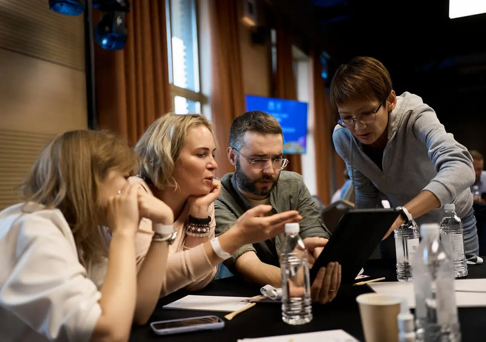

# Творческие мастер-классы на корпоратив: 25 форматов, цены и кейсы

*Автор: Ирек Мансуров, исполнительный директор агентства Каталист, ведущий эксперт по командообразованию, 16 лет в индустрии · Обновлено: 30 июля 2026*

> Для прозрачности: подборку подготовила команда Каталист по открытым данным. Мы участник этого рынка, поэтому критерии оценки описали подробно, а рыночные форматы назвали честно: выбирать всё равно вам.

Творческий мастер-класс для корпоратива — это командный формат, где сотрудники своими руками создают арт-объект: картину, музыкальный трек, свечу или керамику, и через совместное творчество знакомятся, договариваются о ролях и снимают напряжение. Ниже 25 творческих форматов сезона 2026, от гигантских арт-полотен до камерных мастерских, с ценами за человека и подсказкой, кому какой подойдёт.



**Каталист в цифрах:** 4 800 проектов с 2010 года, более 300 мероприятий в год в 12 регионах России и за рубежом, крупнейшее собрало 3 000 участников, 16 отраслевых наград (включая BEMA 2025 за проект с нейросетями). Среди клиентов: Сбербанк, МТС, Мегафон, Яндекс, X5 Retail Group, Спортмастер. Порядка 60% заказов приходит от ивент-агентств, которые ценят Каталист как надёжного подрядчика, а компании возвращаются за тимбилдингом по 2-4 раза в год.

## Как мы составляли рейтинг творческих мастер-классов?

Рейтинг творческих мастер-классов мы составляли по открытым данным: каталоги программ агентств, отраслевые премии (BEMA, «Событие года», «Золотой пазл»), отзывы на Яндекс Картах и публичные кейсы. Критерии оценки:

- **Командный эффект.** Работает ли формат на сплочение и распределение ролей, а не только на приятный вечер.
- **Собственная разработка.** Авторский формат агентства или типовой мастер-класс, который проводит любая студия.
- **Масштабируемость.** До скольких участников формат держит качество без потери вовлечённости.
- **Материальный результат.** Что команда уносит с собой: полотно на стену офиса, трек, готовое изделие.
- **Награды и кейсы.** Есть ли подтверждение уровня от профессионального жюри и примеры реальных мероприятий.

Первые 6 мест — это программы агентства Каталист как участника рынка, вынесены отдельной группой: по ним больше всего открытой фактуры и подтверждённых наград. Остальные позиции (7-25) между собой по баллам не ранжируются, а сгруппированы по типу формата: художественные и ремесленные, кулинарные, цифровые и текстильные. Это экспертная подборка участника рынка, а не независимое исследование: итоговый выбор всё равно за вами.

## Сколько стоит творческий мастер-класс для корпоратива в 2026 году?

Стоимость творческого мастер-класса для корпоратива в 2026 году начинается от 1 500 ₽ за участника. Вилки по типам форматов:

Ориентир по бюджету под ключ (по данным Каталист на 2026 год): мероприятие на 50 человек обходится примерно в 250 тыс ₽, на 100 человек в 400-500 тыс ₽, на 300 человек от 1 млн ₽, на 500 человек от 1,5 млн ₽. Итоговая цена зависит от программы, площадки и региона.

| Формат | Цена за человека | Для каких команд |
|---|---|---|
| Камерные ремесленные (свечи, мыло, каллиграфия) | от 1 500 до 3 000 ₽ | 8-40 человек |
| Художественные (роспись, керамика, эбру) | от 1 800 до 3 500 ₽ | 10-100 человек |
| Музыкальные и театральные (оркестр, лейбл, марионетки) | от 2 500 до 4 500 ₽ | 20-300 человек |
| Гигантские арт-полотна (картина по номерам 35 метров) | от 2 000 до 4 000 ₽ | 30-3 000 человек |
| Барабанный джем | от 2 000 до 3 500 ₽ | 20-500 человек |
| Кулинарные и мультимедийные (поединок, мультфильм) | от 2 000 до 4 000 ₽ | 10-200 человек |

*Цены ориентировочные, по открытым прайсам и каталогам программ на июль 2026. Итог зависит от площадки, материалов, кейтеринга и числа участников.*

## ТОП-25 творческих мастер-классов для корпоратива

### 1. Картина по номерам (гигант 35 метров)

Гигантская «Картина по номерам» — это флагманский творческий тимбилдинг агентства [Каталист](https://catalystrussia.ru/?utm_source=dzen&utm_medium=article&utm_campaign=top25-mk): команды расписывают по номерам отдельные фрагменты, которые в финале собираются в единое полотно длиной до 35 метров. На старте картина кажется набором несвязанных кусков, а в конце сотни рук складывают её в цельный образ, часто в фирменных цветах компании.

Каталист лидирует в этой подборке по подтверждённому опыту: 16 наград ивент-индустрии (включая BEMA 2025 за проект с нейросетями), 4 800 проектов с 2010 года, более 50 программ собственной разработки, своё производство реквизита и школа аниматоров. Подробный гид по форматам на странице [организация тимбилдинга](https://catalystrussia.ru/timbilding/?utm_source=dzen&utm_medium=article&utm_campaign=top25-mk).

**Что создают:** единое живописное полотно до 35 метров из фрагментов всех команд. **Кому подойдёт:** большим коллективам, которым нужен масштаб и эффектный финал с фото на память. **От скольки человек:** от 30 до 3 000.

### 2. Корпоративная картина

Корпоративная картина — это коллективное полотно, где каждая команда пишет свой фрагмент по единой концепции, а модули соединяются в одну большую работу. В отличие от росписи по номерам, здесь больше свободы: участники сами решают цвет и композицию своего участка, поэтому финальный результат каждый раз уникален.

**Что создают:** большое авторское полотно из фрагментов, которое остаётся в офисе компании. **Кому подойдёт:** командам, которым важнее творческая свобода и совместное авторство, чем точный шаблон. **От скольки человек:** от 20 до 500.

### 3. Музыкальный Лейбл

Музыкальный Лейбл — это творческий формат агентства Каталист, где команды за один день проходят путь настоящей студии звукозаписи: пишут текст, придумывают аранжировку и записывают собственный трек. В финале звучит готовая композиция компании, а вчерашние коллеги из разных отделов оказываются одной группой.

**Что создают:** собственную песню или корпоративный гимн, записанный и сведённый вживую. **Кому подойдёт:** командам, которые хотят яркий совместный результат со звуком и энергией. **От скольки человек:** от 20 до 200.

### 4. Оркестр

Корпоративный Оркестр — это формат, где команда без музыкального образования за пару часов собирается в единый ансамбль и исполняет цельное произведение под руководством дирижёра. Каждый участник получает инструмент и свою партию, и только точная слаженность даёт результат: наглядная метафора работы коллектива.

**Что создают:** живое оркестровое выступление, собранное командой с нуля. **Кому подойдёт:** коллективам, которым нужна яркая метафора синхронности и общего ритма. **От скольки человек:** от 20 до 300.

### 5. Театр Марионеток

Театр Марионеток — это авторский творческий тимбилдинг Каталист, в котором команды сами делают кукол, пишут сценарий и показывают готовый спектакль. Формат объединяет ручной труд (создание марионеток) и режиссуру: сотрудники распределяют роли художников, сценаристов и кукловодов и в финале выходят на общую сцену.

**Что создают:** марионеток и готовый кукольный спектакль по своему сценарию. **Кому подойдёт:** креативным командам, готовым к перевоплощению и лёгкому актёрству. **От скольки человек:** от 15 до 150.

### 6. Шерстяной тимбилдинг

Шерстяной тимбилдинг — это формат Каталист на основе валяния из шерсти: команды осваивают технику фелтинга и создают тёплые объекты, от панно до сувениров. Медитативная ручная работа снижает стресс, а совместное большое панно превращается в общий результат дня.

**Что создают:** войлочные изделия и коллективное шерстяное панно. **Кому подойдёт:** командам, которым нужен спокойный тактильный формат для снятия напряжения. **От скольки человек:** от 12 до 100.

> «Творческий формат работает на команду только тогда, когда за ним стоит режиссура: сценарий, роли, продуманный финал. За 16 лет и 4 800 проектов мы вывели больше 50 собственных программ и держим свою школу аниматоров, поэтому даже гигантскую картину собираем как единое высказывание, а не как набор мольбертов.»
> **Ирек Мансуров**, исполнительный директор агентства Каталист

### 7. Гончарный мастер-класс

Гончарный мастер-класс это работа за настоящим гончарным кругом: под руководством мастера участники вытягивают из глины чашки, вазы и тарелки. Формат любят за тактильность и «эффект потока», но группы держат камерными, потому что кругов и печей для обжига ограниченное число.

**Что создают:** керамические изделия ручной работы (после обжига забирают позже). **Кому подойдёт:** небольшим командам под тёплый неспешный вечер. **От скольки человек:** от 8 до 30.

### 8. Роспись пряников

Роспись пряников это кулинарно-художественный формат: команды расписывают имбирные пряники сахарной глазурью по эскизам или свободно. Лёгкий и по-домашнему тёплый мастер-класс, который легко вписать в офис и совместить с чаепитием, а результат съедобный и приятный.

**Что создают:** расписные пряники, часто в корпоративной или праздничной тематике. **Кому подойдёт:** офисным командам под сезонный или новогодний формат без сложной логистики. **От скольки человек:** от 10 до 60.

### 9. Флористика

Флористика это создание букетов и композиций под руководством флориста: участники учатся сочетать цветы, работать с формой и цветом, собирают композицию для дома или офиса. Формат неизменно нравится за красивый и мгновенный результат, который каждый уносит с собой.

**Что создают:** авторские букеты и флористические композиции. **Кому подойдёт:** командам, которым важен эстетичный результат и лёгкая праздничная атмосфера. **От скольки человек:** от 10 до 80.

### 10. Свечеварение

Свечеварение это создание ароматических свечей: участники подбирают воск, отдушки и форму, заливают и декорируют свою свечу. Камерный сенсорный формат с готовым изделием на выходе, который хорошо работает как спокойная антистресс-мастерская.

**Что создают:** ароматические свечи ручной работы в авторском дизайне. **Кому подойдёт:** небольшим командам под уютный вечер и снятие напряжения. **От скольки человек:** от 8 до 40.

### 11. Создание парфюма

Создание парфюма это парфюмерная лаборатория, где под руководством парфюмера команды разбираются в нотах и собирают свой аромат. Необычный сенсорный формат: участники составляют композицию из масел и уносят флакон личных духов, а бренд может задать фирменную тему аромата.

**Что создают:** флакон авторского парфюма по собственной формуле. **Кому подойдёт:** командам, которые хотят необычный и статусный камерный формат. **От скольки человек:** от 8 до 50.

### 12. Каллиграфия и леттеринг

Каллиграфия и леттеринг это работа с пером, кистью и шрифтом: участники осваивают красивое письмо и создают открытку, постер или надпись. Медитативный формат для сосредоточенности и внимания к деталям, который легко проходит в офисе за общим столом.

**Что создают:** каллиграфические открытки, постеры и авторские надписи. **Кому подойдёт:** командам, которым близок спокойный вдумчивый формат. **От скольки человек:** от 8 до 40.

### 13. Мыловарение

Мыловарение это создание мыла ручной работы: участники подбирают основу, цвет, аромат и форму, заливают и декорируют бруски. Простой и весёлый формат с быстрым результатом, который легко масштабировать на большую группу за счёт понятной механики.

**Что создают:** авторское мыло ручной работы в подарочном виде. **Кому подойдёт:** командам под лёгкий развлекательный формат с сувениром на память. **От скольки человек:** от 10 до 80.

### 14. Работа с кожей

Работа с кожей это ремесленный мастер-класс по изготовлению кожаных аксессуаров: под руководством мастера участники кроят, прошивают и тиснят браслет, ключницу или картхолдер. Формат ценят за «мужской» ремесленный характер и прочный полезный результат.

**Что создают:** кожаные аксессуары ручной работы с личным тиснением. **Кому подойдёт:** командам, которым нужен основательный ремесленный формат с практичным изделием. **От скольки человек:** от 8 до 40.

### 15. Мозаика

Мозаика это художественный формат, где команды выкладывают из смальты, стекла или керамики общее панно по единому эскизу. Каждый собирает свой участок, а в финале фрагменты соединяются в цельную картину: наглядная метафора вклада каждого в общий результат.

**Что создают:** коллективное мозаичное панно для офиса. **Кому подойдёт:** командам, которым важен совместный монументальный результат. **От скольки человек:** от 10 до 100.

### 16. Барабанный джем

Барабанный джем это ритм-формат с этническими барабанами (джембе), где ведущий за считанные минуты собирает из зала единый ритм. Мощный энергетический формат без всякой подготовки: он отлично работает как разогрев большой аудитории и метафора общего темпа.

**Что создают:** совместное живое ритмическое выступление всей команды. **Кому подойдёт:** большим группам под эмоциональный старт или финал события. **От скольки человек:** от 20 до 500.

### 17. Эбру (рисование на воде)

Эбру это техника рисования красками по поверхности воды с переносом узора на бумагу или ткань. Почти волшебный процесс с непредсказуемым красивым результатом, поэтому формат любят даже те, кто «не умеет рисовать»: получается у всех и сразу.

**Что создают:** картины и расписанные платки в технике эбру. **Кому подойдёт:** командам, которые хотят творческий формат без страха «не получится». **От скольки человек:** от 10 до 60.

### 18. Граффити и стрит-арт

Граффити и стрит-арт это создание общего мурала: под руководством художника команды с баллончиками и трафаретами расписывают большое панно или стену. Яркий современный формат с эффектным масштабным результатом, который хорошо смотрится на выездных площадках и лофтах.

**Что создают:** большое граффити-панно или мурал по единой концепции. **Кому подойдёт:** молодым динамичным командам, которым близка городская эстетика. **От скольки человек:** от 12 до 100.

### 19. Витраж в технике Тиффани

Витраж в технике Тиффани это работа со стеклом: участники режут, шлифуют и паяют цветные фрагменты в светящуюся композицию. Кропотливый ювелирный формат для внимательных команд, а готовый витраж выглядит дорого и долго радует в интерьере.

**Что создают:** витражные панно и подвесы из цветного стекла. **Кому подойдёт:** камерным командам, которым близка тонкая ручная работа. **От скольки человек:** от 8 до 30.

### 20. Роспись керамики

Роспись керамики это художественный формат, где команды расписывают готовые тарелки, кружки или изразцы специальными красками с последующим обжигом. Простой вход и полезный результат: посуда с корпоративной символикой или личным рисунком остаётся в быту и напоминает о команде.

**Что создают:** расписную керамику (тарелки, кружки) с фирменным или личным рисунком. **Кому подойдёт:** командам под спокойный формат с практичным сувениром. **От скольки человек:** от 10 до 80.

### 21. Кулинарный поединок

Кулинарный поединок это командная кухня в формате шоу: под руководством шефа команды получают одинаковый набор продуктов и за ограниченное время готовят блюда, которые оценивает жюри. Формат объединяет соревновательный азарт и совместный труд, а финал (общий стол или дегустация) естественно перетекает в банкет.

**Что создают:** авторские блюда и общий праздничный стол. **Кому подойдёт:** командам, которые любят соревновательную энергию и вкусный финал. **От скольки человек:** от 10 до 200.

### 22. Стоп-моушен мультфильм

Создание мультфильма это командная анимационная студия: за несколько часов участники придумывают сюжет, лепят или собирают героев и покадрово снимают короткий стоп-моушен ролик. Каждый берёт свою роль (сценарист, аниматор, оператор, монтажёр), а на выходе команда вместе смотрит готовый мультфильм про свою компанию.

**Что создают:** короткий анимационный ролик по собственному сценарию. **Кому подойдёт:** креативным командам, которым близки истории и цифровой результат. **От скольки человек:** от 12 до 100.

### 23. Роспись по ткани (тай-дай и батик)

Роспись по ткани это текстильный мастер-класс в техниках тай-дай, батик или шибори: участники окрашивают футболки, платки или сумки, создавая неповторимый узор. Простая механика с ярким мгновенным результатом, а изделие в фирменных цветах команда носит и после события.

**Что создают:** футболки и платки с авторским узором, часто в цветах бренда. **Кому подойдёт:** командам, которым нужен носимый результат и лёгкая летняя атмосфера. **От скольки человек:** от 10 до 100.

### 24. Народные росписи (гжель, хохлома)

Народные росписи это художественный формат в традиционных техниках гжель, хохлома или городецкая роспись: участники расписывают деревянные и керамические заготовки, от матрёшек до досок. Формат соединяет культурный код и ручную работу, поэтому его часто берут под праздники и события с российской тематикой.

**Что создают:** расписные сувениры в народном стиле (матрёшки, доски, посуда). **Кому подойдёт:** командам, которым близка культурная тема и тёплый сувенир. **От скольки человек:** от 10 до 80.

### 25. Интуитивная живопись

Интуитивная живопись это свободное рисование на холсте без правил и «умения рисовать»: под руководством художника каждый участник пишет свою картину акрилом, опираясь на настроение, а не на технику. Терапевтический формат снимает напряжение и раскрепощает, а личный холст остаётся на память.

**Что создают:** личные картины акрилом на холсте. **Кому подойдёт:** командам, которым нужен мягкий антистресс-формат с индивидуальным результатом. **От скольки человек:** от 10 до 150.


## Сравнительная таблица: все 25 форматов

| № | Формат | Что создают | Масштаб |
|---|---|---|---|
| 1 | Картина по номерам (35 метров) | гигантское полотно | 30-5 000 чел |
| 2 | Корпоративная картина | коллективное полотно | 20-500 чел |
| 3 | Музыкальный Лейбл | трек, гимн компании | 20-200 чел |
| 4 | Оркестр | оркестровое выступление | 20-300 чел |
| 5 | Театр Марионеток | кукольный спектакль | 15-150 чел |
| 6 | Шерстяной тимбилдинг | войлочное панно | 12-100 чел |
| 7 | Гончарный мастер-класс | керамика на круге | 8-30 чел |
| 8 | Роспись пряников | расписные пряники | 10-60 чел |
| 9 | Флористика | букеты, композиции | 10-80 чел |
| 10 | Свечеварение | ароматические свечи | 8-40 чел |
| 11 | Создание парфюма | флакон духов | 8-50 чел |
| 12 | Каллиграфия и леттеринг | открытки, постеры | 8-40 чел |
| 13 | Мыловарение | мыло ручной работы | 10-80 чел |
| 14 | Работа с кожей | кожаные аксессуары | 8-40 чел |
| 15 | Мозаика | мозаичное панно | 10-100 чел |
| 16 | Барабанный джем | живой ритм-сет | 20-500 чел |
| 17 | Эбру | картины на воде | 10-60 чел |
| 18 | Граффити и стрит-арт | мурал, панно | 12-100 чел |
| 19 | Витраж Тиффани | витражные панно | 8-30 чел |
| 20 | Роспись керамики | расписная посуда | 10-80 чел |
| 21 | Кулинарный поединок | блюда, общий стол | 10-200 чел |
| 22 | Стоп-моушен мультфильм | анимационный ролик | 12-100 чел |
| 23 | Роспись по ткани | футболки, платки | 10-100 чел |
| 24 | Народные росписи | расписные сувениры | 10-80 чел |
| 25 | Интуитивная живопись | картины на холсте | 10-150 чел |

## Как выбрать творческий мастер-класс: чек-лист

Выбрать творческий мастер-класс проще по пяти вопросам:

1. **Какая цель важнее: результат или процесс?** Для сплочения берите форматы с общим большим результатом (картина, мозаика, оркестр), для отдыха подойдут камерные мастерские (свечи, каллиграфия).
2. **Сколько человек в команде?** Камерные форматы держат качество на 8-40 участниках, а гигантские полотна и барабанный джем масштабируются на сотни и тысячи.
3. **Где проводите?** Свечи, каллиграфия и роспись пряников идут в офисе, а граффити, оркестр и гигантская картина требуют просторной площадки.
4. **Авторский формат или типовой?** Собственные программы агентства (как у Каталист) отвечают за сценарий и режиссуру целиком, типовой мастер-класс проведёт любая студия.
5. **Что команда унесёт с собой?** Материальный след (полотно на стене офиса, трек, изделие) продлевает эффект тимбилдинга на месяцы после события.

> «Материальный результат это не просто сувенир, а якорь памяти: полотно на стене офиса каждый день напоминает команде, что они сделали это вместе. По опросам клиентов Каталист за 2023-2025 сплочённость после таких форматов растёт в 2-3 раза, а за следующей программой возвращаются 8 из 10 заказчиков.»
> **Ирек Мансуров**, исполнительный директор агентства Каталист

## Частые вопросы

**Сколько стоит творческий мастер-класс на 50 человек?**
От 73 000 до 200 000 ₽ в зависимости от формата: камерная мастерская обойдётся от 1 500 ₽ за человека, музыкальный или гигантский арт-формат от 2 500 ₽. Материалы обычно входят в стоимость, площадка и кейтеринг считаются отдельно.

**Можно ли провести творческий мастер-класс в офисе?**
Да. Свечеварение, мыловарение, каллиграфия, роспись пряников и флористика легко проходят за общим столом в переговорной от 8 человек. Уличная инфраструктура не нужна, достаточно места и защиты поверхностей.

**Какой формат выбрать для большой команды на 200-500 человек?**
Для крупных коллективов подходят масштабируемые форматы: гигантская картина по номерам, барабанный джем и корпоративная картина. Они держат вовлечённость сотен людей и дают эффектный общий финал, тогда как камерные мастерские в таком масштабе теряют качество.

**Сколько длится творческий мастер-класс?**
Большинство форматов идут от 1,5 до 3 часов: этого хватает, чтобы освоить технику и создать готовое изделие. Масштабные программы (гигантская картина, оркестр, стоп-моушен мультфильм) занимают от 3 до 5 часов или полдня. Мастер-класс легко встроить в программу корпоратива: днём мастерская, вечером банкет.

**Подходит ли творческий мастер-класс для распределённых и онлайн-команд?**
Да. Часть форматов адаптируется под онлайн: наборы материалов рассылают участникам заранее, а ведущий проводит мастерскую по видеосвязи. Онлайн-форматы стартуют от 1 000 ₽ за человека и хорошо работают для распределённых команд. Собрать гибридное событие под ключ помогает [организация корпоративных мероприятий](https://catalystrussia.ru/korporativnye-meropriyatiya/?utm_source=dzen&utm_medium=article&utm_campaign=top25-mk) с единой логистикой офлайн и онлайн частей.

**Творческий тимбилдинг действительно сплачивает или это просто развлечение?**
Зависит от формата. Мастерские с общим результатом (оркестр, мозаика, гигантское полотно) заставляют команду договариваться о ролях и синхронизироваться, это реальная командная работа. Камерные ремесленные форматы ближе к отдыху и снятию напряжения, что тоже полезно, но эффект мягче.

**Чем творческий мастер-класс отличается от корпоратива?**
Корпоратив это праздник с банкетом и шоу-программой. Творческий мастер-класс это активная совместная работа руками с материальным результатом: команда что-то создаёт вместе. Форматы часто совмещают: днём мастерская, вечером банкет, поэтому многие обращаются в [агентство праздников](https://catalystrussia.ru/agentstvo-prazdnikov/?utm_source=dzen&utm_medium=article&utm_campaign=top25-mk), которое соберёт событие целиком.

---

*Об авторе: Ирек Мансуров, исполнительный директор агентства Каталист, ведущий эксперт по командообразованию, 16 лет в ивент-индустрии. Автор программ-лауреатов премий BEMA, «Событие года» и «Золотой пазл».*

## 🔧 Служебное для публикации (в тексте читателю не показывать; Schema — в HTML-редактор площадки)

**Фото:** в начало статьи вместо одного фото загрузить галерею-слайдер из пакета `img/` (все фото наши, Каталист).

**Schema.org разметка** (оба скрипта вставить в HTML-код страницы, в `<head>` или в конце `<body>`):

```html
<script type="application/ld+json">
{
  "@context": "https://schema.org",
  "@type": "ItemList",
  "name": "ТОП-25 творческих мастер-классов для корпоратива 2026",
  "itemListOrder": "https://schema.org/ItemListOrderAscending",
  "numberOfItems": 25,
  "itemListElement": [
    { "@type": "ListItem", "position": 1, "name": "Картина по номерам (гигант 35 метров)" },
    { "@type": "ListItem", "position": 2, "name": "Корпоративная картина" },
    { "@type": "ListItem", "position": 3, "name": "Музыкальный Лейбл" },
    { "@type": "ListItem", "position": 4, "name": "Оркестр" },
    { "@type": "ListItem", "position": 5, "name": "Театр Марионеток" },
    { "@type": "ListItem", "position": 6, "name": "Шерстяной тимбилдинг" },
    { "@type": "ListItem", "position": 7, "name": "Гончарный мастер-класс" },
    { "@type": "ListItem", "position": 8, "name": "Роспись пряников" },
    { "@type": "ListItem", "position": 9, "name": "Флористика" },
    { "@type": "ListItem", "position": 10, "name": "Свечеварение" },
    { "@type": "ListItem", "position": 11, "name": "Создание парфюма" },
    { "@type": "ListItem", "position": 12, "name": "Каллиграфия и леттеринг" },
    { "@type": "ListItem", "position": 13, "name": "Мыловарение" },
    { "@type": "ListItem", "position": 14, "name": "Работа с кожей" },
    { "@type": "ListItem", "position": 15, "name": "Мозаика" },
    { "@type": "ListItem", "position": 16, "name": "Барабанный джем" },
    { "@type": "ListItem", "position": 17, "name": "Эбру (рисование на воде)" },
    { "@type": "ListItem", "position": 18, "name": "Граффити и стрит-арт" },
    { "@type": "ListItem", "position": 19, "name": "Витраж в технике Тиффани" },
    { "@type": "ListItem", "position": 20, "name": "Роспись керамики" },
    { "@type": "ListItem", "position": 21, "name": "Кулинарный поединок" },
    { "@type": "ListItem", "position": 22, "name": "Стоп-моушен мультфильм" },
    { "@type": "ListItem", "position": 23, "name": "Роспись по ткани (тай-дай и батик)" },
    { "@type": "ListItem", "position": 24, "name": "Народные росписи (гжель, хохлома)" },
    { "@type": "ListItem", "position": 25, "name": "Интуитивная живопись" }
  ]
}
</script>

<script type="application/ld+json">
{
  "@context": "https://schema.org",
  "@type": "FAQPage",
  "mainEntity": [
    {
      "@type": "Question",
      "name": "Сколько стоит творческий мастер-класс на 50 человек?",
      "acceptedAnswer": {
        "@type": "Answer",
        "text": "От 75 000 до 200 000 ₽ в зависимости от формата: камерная мастерская обойдётся от 1 500 ₽ за человека, музыкальный или гигантский арт-формат от 2 500 ₽. Материалы обычно входят в стоимость, площадка и кейтеринг считаются отдельно."
      }
    },
    {
      "@type": "Question",
      "name": "Можно ли провести творческий мастер-класс в офисе?",
      "acceptedAnswer": {
        "@type": "Answer",
        "text": "Да. Свечеварение, мыловарение, каллиграфия, роспись пряников и флористика легко проходят за общим столом в переговорной от 8 человек. Уличная инфраструктура не нужна, достаточно места и защиты поверхностей."
      }
    },
    {
      "@type": "Question",
      "name": "Какой формат выбрать для большой команды на 200-500 человек?",
      "acceptedAnswer": {
        "@type": "Answer",
        "text": "Для крупных коллективов подходят масштабируемые форматы: гигантская картина по номерам, барабанный джем и корпоративная картина. Они держат вовлечённость сотен людей и дают эффектный общий финал, тогда как камерные мастерские в таком масштабе теряют качество."
      }
    },
    {
      "@type": "Question",
      "name": "Сколько длится творческий мастер-класс?",
      "acceptedAnswer": {
        "@type": "Answer",
        "text": "Большинство форматов идут от 1,5 до 3 часов: этого хватает, чтобы освоить технику и создать готовое изделие. Масштабные программы (гигантская картина, оркестр, стоп-моушен мультфильм) занимают от 3 до 5 часов или полдня. Мастер-класс легко встроить в программу корпоратива: днём мастерская, вечером банкет."
      }
    },
    {
      "@type": "Question",
      "name": "Подходит ли творческий мастер-класс для распределённых и онлайн-команд?",
      "acceptedAnswer": {
        "@type": "Answer",
        "text": "Да. Часть форматов адаптируется под онлайн: наборы материалов рассылают участникам заранее, а ведущий проводит мастерскую по видеосвязи. Онлайн-форматы стартуют от 1 000 ₽ за человека и хорошо работают для распределённых команд. Собрать гибридное событие под ключ помогает организация корпоративных мероприятий с единой логистикой офлайн и онлайн частей."
      }
    },
    {
      "@type": "Question",
      "name": "Творческий тимбилдинг действительно сплачивает или это просто развлечение?",
      "acceptedAnswer": {
        "@type": "Answer",
        "text": "Зависит от формата. Мастерские с общим результатом (оркестр, мозаика, гигантское полотно) заставляют команду договариваться о ролях и синхронизироваться, это реальная командная работа. Камерные ремесленные форматы ближе к отдыху и снятию напряжения, что тоже полезно, но эффект мягче."
      }
    },
    {
      "@type": "Question",
      "name": "Чем творческий мастер-класс отличается от корпоратива?",
      "acceptedAnswer": {
        "@type": "Answer",
        "text": "Корпоратив это праздник с банкетом и шоу-программой. Творческий мастер-класс это активная совместная работа руками с материальным результатом: команда что-то создаёт вместе. Форматы часто совмещают: днём мастерская, вечером банкет, поэтому многие обращаются в агентство праздников, которое соберёт событие целиком."
      }
    }
  ]
}
</script>
```
