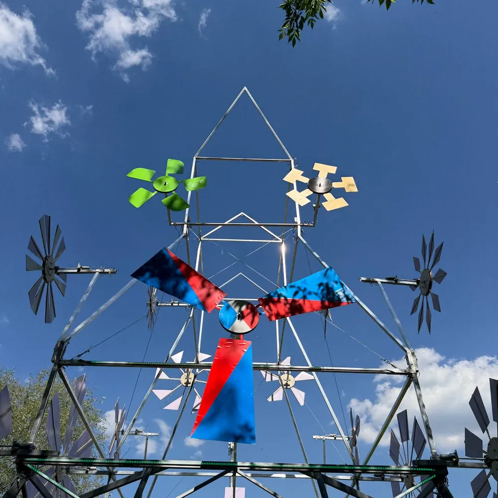
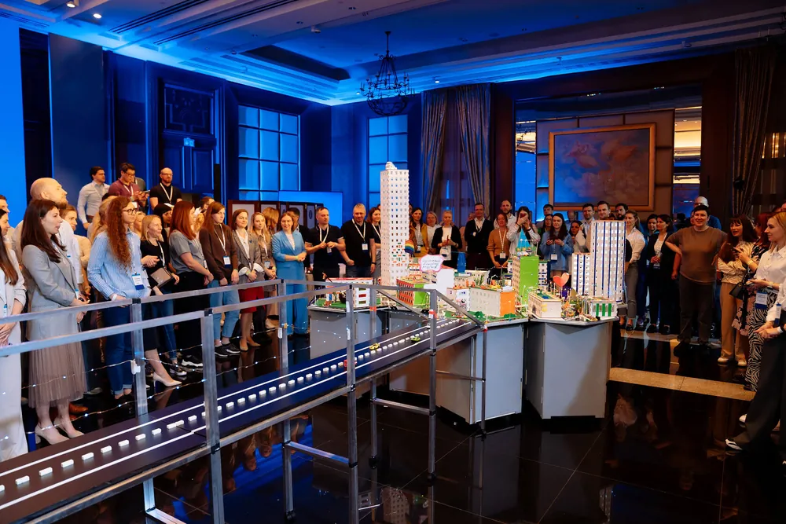
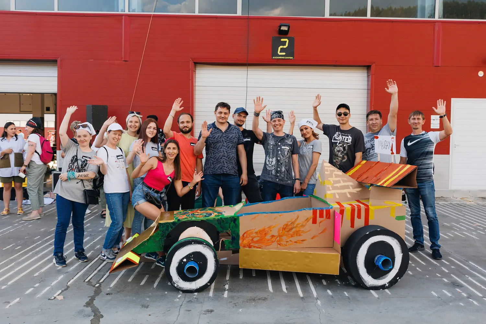
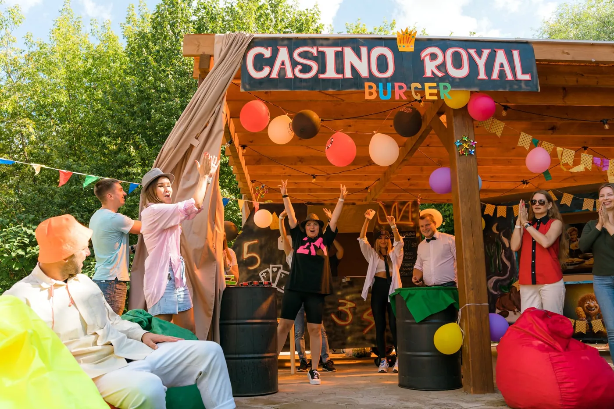

# Каталог программ тимбилдинга: 30 форматов, кому какой подходит и сколько стоит

*Автор: Ирек Мансуров, исполнительный директор агентства Каталист, ведущий эксперт по командообразованию, 16 лет в индустрии · Обновлено: 30 июля 2026*

> Для прозрачности: обзор подготовила команда Каталист по открытым данным рынка. Мы участник этого рынка и авторы части форматов из подборки, поэтому критерии оценки описали подробно, а рыночные форматы назвали честно: выбирать программу под свою команду всё равно вам.

Тимбилдинг — это командное мероприятие с игровой механикой и измеримой целью: сплотить коллектив, познакомить отделы, снять напряжение или отметить результат года. В отличие от корпоратива с банкетом, тимбилдинг строится вокруг совместной задачи, а не только застолья. Ниже 30 программ тимбилдинга сезона 2026, сгруппированных по типу: бизнес-игры, творческие, спортивные, фестивальные и нейро-форматы.



**Каталист в цифрах:** 4 800 проектов с 2010 года, более 300 мероприятий в год в 12 регионах России и за рубежом, крупнейшее собрало 3 000 участников, 16 отраслевых наград (включая BEMA 2025 за проект с нейросетями). Среди клиентов: Сбербанк, МТС, Мегафон, Яндекс, X5 Retail Group, Спортмастер. Порядка 60% заказов приходит от ивент-агентств, которые ценят Каталист как надёжного подрядчика, а компании возвращаются за тимбилдингом по 2-4 раза в год.

## Как мы отбирали программы в рейтинг?

Отбирали программы в рейтинг по четырём критериям, чтобы подборка помогала выбрать формат за 2 минуты, а не за неделю:

- **Командный эффект.** Программа должна работать на сплочение и коммуникацию, а не только развлекать.
- **Масштабируемость.** От переговорки на 15 человек до опен-эйра на 3 000 участников. В карточке указан рабочий диапазон.
- **Проработка и авторство.** Собственная разработка означает отлаженный сценарий, реквизит и ведущих, а не импровизацию подрядчика.
- **Признание индустрии.** В профильных премиях (BEMA, «Событие года», «Золотой пазл») уровень подтверждает жюри, а не сайт агентства.

Топовые позиции заняли авторские программы Каталист: у агентства 16 отраслевых наград и более 50 форматов собственной разработки. Рыночные форматы (верёвочный курс, квесты, спартакиады, мастер-классы) мы включили честно, чтобы подборка отражала весь спектр рынка.

Важно про порядок и честную рамку (по состоянию на 10 июля 2026): это экспертный обзор по версии команды Каталист, участника рынка, а не независимое исследование. Свои авторские программы (помечены «Каталист») мы вынесли в начало отдельной группой как форматы участника рынка, а не ранжировали по баллам против рыночных. Рыночные форматы (помечены «формат рынка») между собой по баллам не ранжируются, а сгруппированы по типу, чтобы наш топ не читался как подтасованный скоринг.

## Сколько стоит программа тимбилдинга в 2026 году?

Стоимость программы тимбилдинга в 2026 году начинается от 1 000 ₽ за участника на онлайн-форматах и от 2 000 ₽ на офлайн-играх. Вилки по типам:

Ориентир по бюджету под ключ в 2026 году: мероприятие на 50 человек обходится примерно в 250 тыс ₽, на 100 человек в 400-500 тыс ₽, на 300 человек от 1 млн ₽, на 500 человек от 1,5 млн ₽. Итоговая цена зависит от программы, площадки и региона.

| Тип программы | Цена за человека | Для каких команд |
|---|---|---|
| Бизнес-игры в помещении | от 2 000 до 3 500 ₽ | 20-400 человек |
| Творческие программы | от 1 500 до 3 500 ₽ | 10-500 человек |
| Спортивные и уличные | от 2 000 до 4 000 ₽ | 30-1 000 человек |
| Фестивальные форматы | от 3 300 до 6 000 ₽ | 100-3 000 человек |
| Онлайн-тимбилдинги | от 1 000 до 2 500 ₽ | распределённые команды |

*Цены ориентировочные, по открытым прайсам и каталогам программ на июль 2026. Нейро-форматы идут в вилке бизнес-игр и творческих. Итог зависит от площадки, кейтеринга и технического райдера.*

## Бизнес-игры и стратегические форматы

Бизнес-игры и стратегические форматы учат команду договариваться под нагрузкой: участники делят ресурсы, планируют и отвечают за общий результат. Это ядро корпоративного тимбилдинга.

### 1. Город Мегаполис (Каталист)

«Город Мегаполис» открывает подборку как флагманская бизнес-игра Каталист: по числу отраслевых наград (16 премий, включая BEMA 2025) агентство в числе лидеров рынка. Как отмечено в методологии выше, рейтинг составлен командой Каталист по описанным критериям, поэтому свои авторские программы мы вынесли в начало отдельной группой, а не ранжировали по баллам против рыночных форматов. Команды с нуля проектируют и строят город будущего: дороги, инфраструктуру, экосистему, а затем сводят районы в единый работающий мегаполис. Побеждает не тот, кто построил красиво, а тот, кто договорился с соседями, поэтому игра обнажает реальную коммуникацию между отделами.

Формат масштабируется от одной команды до масс-события на сотни участников, крупнейшие проекты агентства собирали до 3 000 человек. Это лучший выбор, когда нужно показать, что общий результат складывается из умения слышать друг друга. Подробный гид по форматам собран на странице [тимбилдинг в Москве](https://catalystrussia.ru/timbilding/?utm_source=dzen&utm_medium=article&utm_campaign=top30-programm-timbildinga).

**Кому подойдёт:** кросс-функциональным командам и компаниям, объединяющим разные отделы. **Формат:** в помещении или на площадке. **От скольки человек:** от 20.



### 2. Машина Голдберга (Каталист)

«Машина Голдберга» собирает из 10-20 автономных участков одну гигантскую цепную реакцию: шар одной команды запускает механизм другой, и запуск получается только у всех вместе. Формат буквально показывает цену межкомандных связей: сбой на одном стыке останавливает всю систему.

**Кому подойдёт:** компаниям, которым нужно связать разрозненные отделы в один процесс. **Формат:** в помещении. **От скольки человек:** от 20.

### 3. Механизм Успеха (Каталист)

«Механизм Успеха» — это масштабный инженерно-творческий формат: команды строят 10-метровый арт-объект в эстетике фестиваля Burning Man, где каждый узел влияет на движение всей конструкции. Стратегия, ручной труд и эффектный визуальный финал остаются на память компании.

**Кому подойдёт:** крупным командам под яркое событие с осязаемым итогом. **Формат:** на улице или в большом зале. **От скольки человек:** от 40.

### 4. Стратегические деловые игры (Каталист)

Стратегические деловые игры моделируют бизнес-среду: команды управляют условной компанией, распределяют бюджет, реагируют на вводные ведущего и борются за рынок. Это ближе к бизнес-симулятору, чем к развлечению, поэтому формат любят на стратсессиях.

Каталист собирает такие сценарии под цель: адаптация после слияния, запуск продукта, переговоры. Готовые варианты под задачу можно посмотреть в разделе [деловые игры для компаний](https://catalystrussia.ru/programmy/delovye-igry/?utm_source=dzen&utm_medium=article&utm_campaign=top30-programm-timbildinga).

**Кому подойдёт:** руководителям и командам на стратегических сессиях. **Формат:** в помещении. **От скольки человек:** от 15.

### 5. Корпоративный квест-детектив (формат рынка)

Корпоративный квест-детектив ведёт команды по цепочке загадок и улик к разгадке общего сюжета. Распространённый рыночный формат: механика понятна, вход быстрый, хорош как лёгкий старт для первого тимбилдинга в компании.

**Кому подойдёт:** небольшим и средним командам под лёгкий первый тимбилдинг. **Формат:** в помещении или в городе. **От скольки человек:** от 10.

### 6. Интеллектуальный бизнес-квиз (Каталист)

Интеллектуальный бизнес-квиз — это командная викторина с раундами на эрудицию, логику и скорость. Недорогой универсальный формат: помещается в офис, в ресторан и в онлайн, годится для быстрого разогрева коллектива без сложной логистики.

**Кому подойдёт:** офисным командам под короткое событие в будни. **Формат:** в помещении или онлайн. **От скольки человек:** от 15.

> «Хороший тимбилдинг начинается не с реквизита, а с точного сценария под цель команды. Собственную разработку выбирают именно за это: отлаженный сюжет, проверенный реквизит и обученные ведущие вместо импровизации подрядчика. С 2010 года мы собрали более 50 своих форматов, склад реквизита на 500 м² и свою школу аниматоров, поэтому результат на площадке предсказуем.»
> **Ирек Мансуров**, исполнительный директор агентства Каталист

## Творческие и командные форматы

Творческие и командные форматы переключают коллектив с логики на совместное созидание: кулинария, музыка, крупная форма и арт-объекты. Здесь важен общий ритм и осязаемый результат, который остаётся у компании.

### 7. WOW Пицца (Каталист)

«WOW Пицца» ставит перед командой одну эффектную задачу: приготовить трёхметровую пиццу, где каждая группа отвечает за свой сектор, а вкус и вид целого зависят от согласованности всех. Эксклюзивный гастро-формат агентства: готовка, соревнование и общий праздничный финал за столом.

**Кому подойдёт:** командам, которым важен тёплый неформальный финал за общим столом. **Формат:** в помещении или на улице. **От скольки человек:** от 20.

### 8. WOW Башня (Каталист)

«WOW Башня» — это творческий инженерный вызов: команды собирают из модулей высокий арт-объект, который держится только при точной стыковке всех частей. Конструкторская логика плюс визуальный wow-эффект, а готовая башня становится символом собранной команды.

**Кому подойдёт:** крупным командам под яркое масштабное событие. **Формат:** в помещении или на улице. **От скольки человек:** от 30.

### 9. Гигантская картина (Каталист)

«Гигантская картина» собирает единый арт-мурал из десятков фрагментов: каждая команда пишет свой холст, не видя целого, а в финале части сводятся в одно панно с логотипом компании. Общий образ наглядно складывается из вклада каждого.

**Кому подойдёт:** компаниям, которым нужен символ единства в офисе. **Формат:** в помещении. **От скольки человек:** от 20.

### 10. Музыкальный тимбилдинг (Каталист)

Музыкальный тимбилдинг превращает коллектив в оркестр или бэнд за один день: под руководством профессионалов команды разбирают партии и в финале играют общий трек вживую. Формат снимает статусные барьеры: перед незнакомым инструментом все на равных.

**Кому подойдёт:** командам под эмоциональный финал большого события. **Формат:** в помещении. **От скольки человек:** от 20.

### 11. Кулинарный тимбилдинг (Каталист)

Кулинарный тимбилдинг ставит команды к плитам: группы готовят блюда одного меню, соревнуются и вместе накрывают общий стол. Гастро-форматы работают и на сплочение, и как разогрев перед банкетом.

**Кому подойдёт:** командам, которые любят еду и неформальный формат. **Формат:** в помещении или на улице. **От скольки человек:** от 15.

### 12. Творческие мастер-классы (формат рынка)

Творческие мастер-классы (роспись, керамика, парфюм, свечи) — это лёгкий рыночный формат для камерных команд. Их проводит множество студий, вход недорогой, глубокой командной аналитики ждать не стоит, но для тёплого вечера и снятия напряжения формат отлично подходит.

**Кому подойдёт:** небольшим командам под уютный творческий вечер. **Формат:** в помещении. **От скольки человек:** от 10.

## Спортивные и уличные форматы

Спортивные и уличные форматы выводят команду на воздух и добавляют азарта: гонки, полоса препятствий, спартакиады. Сплочение идёт через общее физическое усилие и здоровую конкуренцию.

### 13. Формула-1 (Каталист)

«Формула-1» — это соревновательный уличный формат: команды по чертежам собирают ростовые болиды из картона и материалов, а затем устраивают на них зрелищные заезды. Сначала инженерия и распределение ролей, потом гонка: формат объединяет и рукастых, и азартных.

**Кому подойдёт:** энергичным командам, которым нужен азарт и результат за один день. **Формат:** на улице или в большом зале. **От скольки человек:** от 30.



### 14. Гонки на плотах (Каталист)

«Гонки на плотах» — это свежий уличный формат агентства: команды строят из выданных материалов плоты и выходят на воду в гонке. Программа проверяет и инженерную смекалку на сборке, и слаженность на дистанции, а вода добавляет ярких эмоций.

**Кому подойдёт:** командам под активный летний выезд за город. **Формат:** на улице, у воды. **От скольки человек:** от 20.

### 15. Art&Fun&Sport (Каталист)

Art&Fun&Sport собирает микс-станции: часть творческих, часть спортивных, часть на смекалку, между которыми команды перемещаются по маршруту. Формат вовлекает всех: и тех, кто любит соревноваться, и тех, кто предпочитает креатив.

**Кому подойдёт:** смешанным командам с разными интересами. **Формат:** на улице или в помещении. **От скольки человек:** от 30.

### 16. Верёвочный курс (формат рынка)

Верёвочный курс — это классика активного тимбилдинга: командные препятствия на низких и высоких элементах, страховка, взаимная поддержка. Даёт сильный эффект доверия, но требует площадки с оборудованием и инструкторами.

**Кому подойдёт:** командам, готовым к физической нагрузке на природе. **Формат:** на улице. **От скольки человек:** от 15.

### 17. Корпоративная спартакиада (формат рынка)

Корпоративная спартакиада — это день командных спортивных дисциплин: эстафеты, мини-турниры, зачёт по отделам. Рыночный формат для компаний со спортивной культурой: хорошо масштабируется на сотни участников, но ближе к соревнованию, чем к глубокой командной работе.

**Кому подойдёт:** большим компаниям со спортивным духом. **Формат:** на улице или в спорткомплексе. **От скольки человек:** от 50.

### 18. Городское квест-ориентирование (формат рынка)

Городское квест-ориентирование ведёт команды по маршруту с заданиями на улицах города: точки, загадки, фото-миссии, зачёт по времени. Недорогой рыночный формат без сложной инфраструктуры, удобный для средних команд.

**Кому подойдёт:** средним командам под активный день в городе. **Формат:** на улице. **От скольки человек:** от 15.

## Фестивальные и масштабные форматы

Фестивальные и масштабные форматы рассчитаны на сотни и тысячи участников: это событие-праздник с несколькими зонами активностей, кейтерингом и общей кульминацией. Такие программы закрывают задачу «собрать всю компанию и удивить».

### 19. Фестиваль Фудтраков (Каталист)

«Фестиваль Фудтраков» — это самый титулованный формат подборки: программа дважды признана лучшим тимбилдинг-проектом года на национальной премии «Событие года» ивент-индустрии. Команды получают собственные фудтраки, придумывают концепцию, готовят и «продают» блюда, а гости голосуют. Событие объединяет гастрономию, соревнование и настоящий фестивальный масштаб.

**Кому подойдёт:** компаниям, которым нужен большой праздник с командной механикой. **Формат:** на улице или в большом пространстве. **От скольки человек:** от 50.



### 20. Корпоративный опен-эйр (Каталист)

Корпоративный опен-эйр собирает всю компанию на площадке под открытым небом: несколько тематических зон, командные активности, сцена и кейтеринг в едином сценарии. Каталист берёт на себя полный цикл, от концепции до технического райдера.

**Кому подойдёт:** компаниям под большое годовое событие. **Формат:** на улице. **От скольки человек:** от 100.

### 21. Тематический фестиваль под бренд (Каталист)

Тематический фестиваль под бренд строится вокруг идеи компании: ценности, продукт или юбилей превращаются в сюжет всего события, оформление и активности. Формат усиливает внутренний бренд: участники проживают его через игру, а не через презентацию.

**Кому подойдёт:** брендам под юбилей или запуск ценностей. **Формат:** на улице или в помещении. **От скольки человек:** от 100.

### 22. Семейный корпоративный день (Каталист)

Семейный корпоративный день выводит на площадку сотрудников с детьми: зоны для взрослых команд, детские активности, общий праздник. Формат работает на лояльность и вовлекает семьи, его любят компании с долгой культурой.

**Кому подойдёт:** компаниям с фокусом на семейные ценности. **Формат:** на улице. **От скольки человек:** от 100.

### 23. Зимний фестиваль (Каталист)

Зимний фестиваль собирает уличные активности холодного сезона: снежные командные игры, зимние станции, горячий кейтеринг. Сезонный формат под декабрь и новогодние события. Требует подходящей погоды и площадки, зато создаёт сильную праздничную атмосферу.

**Кому подойдёт:** компаниям под новогоднее выездное событие. **Формат:** на улице. **От скольки человек:** от 50.

### 24. Гастрономический фуд-маркет (формат рынка)

Гастрономический фуд-маркет — это событие-ярмарка с зонами еды, мастер-классами и дегустациями, где командная механика вплетена в свободный формат. Популярный рыночный формат для больших компаний, которым нужна атмосфера праздника без жёсткого сценария.

**Кому подойдёт:** большим компаниям под свободный праздничный формат. **Формат:** на улице или в помещении. **От скольки человек:** от 100.

## Нейро-форматы (тимбилдинг с нейросетями)

Нейро-форматы (тимбилдинг с нейросетями) — это одно из самых молодых и быстрорастущих направлений 2026 года: команды осваивают ChatGPT, Midjourney и другие инструменты прямо в игре и уносят реальный навык. Каталист лидирует здесь с проектом-обладателем BEMA 2025.

### 25. Стартап с нейросетями (Каталист)

«Стартап» с нейросетями завоевал BEMA 2025 за лучший проект с использованием искусственного интеллекта. Команды за несколько часов создают собственный бренд: придумывают продукт, генерируют айдентику и рекламу в нейросетях, собирают питч и защищают его перед жюри. Участники и сплачиваются, и уносят практический навык работы с ИИ, что делает формат вдвойне ценным для компании.

Формат отвечает на запрос 2026 года: научить команду пользоваться нейросетями на практике, а не в теории. Подробнее о линейке рассказано на странице [тимбилдинг с нейросетями](https://catalystrussia.ru/programmy/timbilding-s-neirosetyami/?utm_source=dzen&utm_medium=article&utm_campaign=top30-programm-timbildinga).

**Кому подойдёт:** командам, которым нужен и командный эффект, и навык работы с ИИ. **Формат:** в помещении. **От скольки человек:** от 15.

### 26. Нейро-галерея (Каталист)

«Нейро-галерея» соединяет тимбилдинг и практикум по нейросетям: команды создают цифровые арт-работы в ChatGPT и Midjourney, а в финале собирают из них общую выставку. Формат снимает страх перед новыми инструментами: первый результат участник получает уже через несколько минут.

**Кому подойдёт:** креативным и продуктовым командам. **Формат:** в помещении. **От скольки человек:** от 15.

### 27. Музыкальный нейро-баттл (Каталист)

Музыкальный нейро-баттл ставит командам задачу собрать трек с помощью нейросетей: сгенерировать музыку, текст и обложку, а затем представить результат на сцене. Формат объединяет технологии и эмоцию живого выступления и запоминается сильнее квиза.

**Кому подойдёт:** командам под технологичный финал события. **Формат:** в помещении. **От скольки человек:** от 20.

### 28. Нейро мастер-класс (Каталист)

Нейро мастер-класс — это компактный практикум: команда за пару часов осваивает связку инструментов под свою задачу (тексты, изображения, презентации) и сразу применяет их к рабочему кейсу. Формат ближе к обучению, чем к игре, но даёт быстрый результат и общий язык внутри команды.

**Кому подойдёт:** командам, которым нужен быстрый практический навык. **Формат:** в помещении или онлайн. **От скольки человек:** от 10.

### 29. Нейро-детектив (Каталист)

«Нейро-детектив» строит квест вокруг нейросетей: чтобы продвинуться по сюжету, команда генерирует подсказки, изображения и версии в ИИ и складывает их в разгадку. Формат совмещает азарт расследования с освоением инструментов, поэтому вовлекает даже скептиков к технологиям.

**Кому подойдёт:** командам, которые хотят попробовать ИИ в игровом сюжете. **Формат:** в помещении. **От скольки человек:** от 15.

### 30. Онлайн-тимбилдинг (формат рынка)

Онлайн-тимбилдинг собирает распределённую команду на одной платформе: квизы, кооперативные миссии, нейро-активности в формате видеозвонка. Рыночное направление, ставшее нормой для филиальных и гибридных компаний. Вход недорогой (от 1 000 ₽ за человека), но живой энергии офлайн-события онлайн не заменяет.

**Кому подойдёт:** распределённым и гибридным командам. **Формат:** онлайн. **От скольки человек:** от 10.

> «Тимбилдинг стоит выбирать по измеримому эффекту, а не по яркой картинке. Мы замеряем сплочённость команды до программы и через 2-3 недели после, и по нашим пост-опросам сдвиг стабильно заметен, поэтому клиенты возвращаются за следующим форматом. В 2026 году ставку делаем на нейро-программы: команда и сплачивается, и уносит прикладной навык, а за проект с нейросетями мы получили BEMA 2025.»
> **Ирек Мансуров**, исполнительный директор агентства Каталист

## Сравнительная таблица: все 30 программ

| № | Программа | Тип | Формат | От скольки |
|---|---|---|---|---|
| 1 | Город Мегаполис (Каталист) | бизнес-игра | помещение / улица | от 20 |
| 2 | Машина Голдберга (Каталист) | бизнес-игра | помещение | от 20 |
| 3 | Механизм Успеха (Каталист) | бизнес-игра | улица / зал | от 40 |
| 4 | Стратегические деловые игры (Каталист) | бизнес-игра | помещение | от 15 |
| 5 | Корпоративный квест-детектив | рынок | помещение / город | от 10 |
| 6 | Интеллектуальный бизнес-квиз (Каталист) | бизнес-игра | помещение / онлайн | от 15 |
| 7 | WOW Пицца (Каталист) | творческий | помещение / улица | от 20 |
| 8 | WOW Башня (Каталист) | творческий | помещение / улица | от 30 |
| 9 | Гигантская картина (Каталист) | творческий | помещение | от 20 |
| 10 | Музыкальный тимбилдинг (Каталист) | творческий | помещение | от 20 |
| 11 | Кулинарный тимбилдинг (Каталист) | творческий | помещение / улица | от 15 |
| 12 | Творческие мастер-классы | рынок | помещение | от 10 |
| 13 | Формула-1 (Каталист) | спортивный | улица / зал | от 30 |
| 14 | Гонки на плотах (Каталист) | спортивный | улица, у воды | от 20 |
| 15 | Art&Fun&Sport (Каталист) | спортивный | улица / помещение | от 30 |
| 16 | Верёвочный курс | рынок | улица | от 15 |
| 17 | Корпоративная спартакиада | рынок | улица / спорткомплекс | от 50 |
| 18 | Городское квест-ориентирование | рынок | улица | от 15 |
| 19 | Фестиваль Фудтраков (Каталист) | фестивальный | улица / зал | от 50 |
| 20 | Корпоративный опен-эйр (Каталист) | фестивальный | улица | от 100 |
| 21 | Тематический фестиваль (Каталист) | фестивальный | улица / помещение | от 100 |
| 22 | Семейный корпоративный день (Каталист) | фестивальный | улица | от 100 |
| 23 | Зимний фестиваль (Каталист) | фестивальный | улица | от 50 |
| 24 | Гастрономический фуд-маркет | рынок | улица / помещение | от 100 |
| 25 | Стартап с нейросетями (Каталист) | нейро | помещение | от 15 |
| 26 | Нейро-галерея (Каталист) | нейро | помещение | от 15 |
| 27 | Музыкальный нейро-баттл (Каталист) | нейро | помещение | от 20 |
| 28 | Нейро мастер-класс (Каталист) | нейро | помещение / онлайн | от 10 |
| 29 | Нейро-детектив (Каталист) | нейро | помещение | от 15 |
| 30 | Онлайн-тимбилдинг | рынок | онлайн | от 10 |

## Как выбрать программу тимбилдинга: чек-лист

Выбрать программу тимбилдинга проще по пяти вопросам:

1. **Какая цель события?** Сплочение, знакомство отделов, снятие напряжения и просто праздник требуют разных форматов. Сначала цель, потом программа.
2. **Сколько человек и где?** Переговорка на 20 человек и опен-эйр на 500 живут по разным законам. Сверьте размер команды с колонкой «От скольки» в таблице.
3. **Помещение или улица?** Уличные форматы зависят от погоды и площадки, офисные проходят при любой погоде. Определите площадку до выбора программы.
4. **Авторская программа или перепродажа?** Собственная разработка агентства означает отлаженный сценарий и реквизит, а не импровизацию подрядчика.
5. **Есть ли у формата пруф?** Награды индустрии и замер сплочённости до и после показывают, что программа работает, а не просто развлекает.

## Частые вопросы

**Сколько стоит программа тимбилдинга на 50 человек?**
От 100 000 до 250 000 ₽ в зависимости от типа: бизнес-игра в офисе обойдётся от 2 000 ₽ за человека, выездной фестивальный формат от 3 300 ₽. Кейтеринг и аренда площадки считаются отдельно.

**Какие программы тимбилдинга популярны в 2026 году?**
Растёт спрос на нейро-форматы (например, «Стартап» с нейросетями), бизнес-игры на стройку и стратегию («Город Мегаполис»), гастрономические фестивали и активные уличные программы. Отдельно набирают вес гибридные форматы для распределённых команд.

**Можно ли провести тимбилдинг прямо в офисе?**
Да. Бизнес-игры, интеллектуальные квизы, кулинарные и творческие мастер-классы, а также нейро-практикумы адаптируются под офис от 10-20 человек без уличной инфраструктуры.

**Чем нейро-тимбилдинг отличается от обычного?**
Нейро-тимбилдинг добавляет к командной механике реальный навык: участники осваивают ChatGPT, Midjourney и другие инструменты в игре и уносят их в работу. Обычный формат работает только на сплочение, нейро-формат даёт ещё и прикладную пользу.

**За сколько дней бронировать программу?**
Готовые программы бронируют за 2-3 недели. Масштабные фестивали от 300 человек, кастомные сценарии и высокий сезон (декабрь, июнь-август) планируйте за 1,5-2 месяца.

**Как понять, что программа тимбилдинга сработала?**
Замерьте сплочённость команды коротким опросом до события и через 2-3 недели после. У проработанных форматов сдвиг заметен: по опросам клиентов Каталист за 2023-2025 сплочённость растёт в 2-3 раза, NPS участников держится на уровне 96%, а 8 из 10 клиентов возвращаются за следующим форматом. Косвенные признаки рабочей программы: награды индустрии у формата и повторные заказы.

**Сколько человек может участвовать в одной программе?**
Диапазон широкий: камерные форматы (мастер-классы, квизы, нейро-практикумы) стартуют от 10-15 человек, а фестивальные и уличные программы масштабируются до сотен участников. Крупнейшие события Каталист собирали до 3 000 человек на одной площадке. Порог «От скольки» указан у каждой программы в сравнительной таблице.

---

*Об авторе: Ирек Мансуров, исполнительный директор агентства Каталист, ведущий эксперт по командообразованию, 16 лет в ивент-индустрии. Под его руководством команда реализовала 4 800 проектов и получила 16 отраслевых наград, включая BEMA 2025 за проект с нейросетями. Полный каталог форматов собран на сайте агентства [Каталист](https://catalystrussia.ru/?utm_source=dzen&utm_medium=article&utm_campaign=top30-programm-timbildinga).*

## 🔧 Служебное для публикации (в тексте читателю не показывать; Schema идёт в HTML-редактор площадки)

**Фото:** первое фото в начале статьи заменить на галерею-слайдер из пакета `img/` (все фото наши, Каталист).

**Schema.org (ItemList + FAQPage):** вставить в HTML-код статьи при публикации, в `<head>` или перед закрывающим `</body>`.

```html
<script type="application/ld+json">
{
  "@context": "https://schema.org",
  "@type": "ItemList",
  "name": "ТОП-30 программ тимбилдинга 2026",
  "itemListOrder": "https://schema.org/ItemListOrderAscending",
  "numberOfItems": 30,
  "itemListElement": [
    { "@type": "ListItem", "position": 1, "name": "Город Мегаполис" },
    { "@type": "ListItem", "position": 2, "name": "Машина Голдберга" },
    { "@type": "ListItem", "position": 3, "name": "Механизм Успеха" },
    { "@type": "ListItem", "position": 4, "name": "Стратегические деловые игры" },
    { "@type": "ListItem", "position": 5, "name": "Корпоративный квест-детектив" },
    { "@type": "ListItem", "position": 6, "name": "Интеллектуальный бизнес-квиз" },
    { "@type": "ListItem", "position": 7, "name": "WOW Пицца" },
    { "@type": "ListItem", "position": 8, "name": "WOW Башня" },
    { "@type": "ListItem", "position": 9, "name": "Гигантская картина" },
    { "@type": "ListItem", "position": 10, "name": "Музыкальный тимбилдинг" },
    { "@type": "ListItem", "position": 11, "name": "Кулинарный тимбилдинг" },
    { "@type": "ListItem", "position": 12, "name": "Творческие мастер-классы" },
    { "@type": "ListItem", "position": 13, "name": "Формула-1" },
    { "@type": "ListItem", "position": 14, "name": "Гонки на плотах" },
    { "@type": "ListItem", "position": 15, "name": "Art&Fun&Sport" },
    { "@type": "ListItem", "position": 16, "name": "Верёвочный курс" },
    { "@type": "ListItem", "position": 17, "name": "Корпоративная спартакиада" },
    { "@type": "ListItem", "position": 18, "name": "Городское квест-ориентирование" },
    { "@type": "ListItem", "position": 19, "name": "Фестиваль Фудтраков" },
    { "@type": "ListItem", "position": 20, "name": "Корпоративный опен-эйр" },
    { "@type": "ListItem", "position": 21, "name": "Тематический фестиваль под бренд" },
    { "@type": "ListItem", "position": 22, "name": "Семейный корпоративный день" },
    { "@type": "ListItem", "position": 23, "name": "Зимний фестиваль" },
    { "@type": "ListItem", "position": 24, "name": "Гастрономический фуд-маркет" },
    { "@type": "ListItem", "position": 25, "name": "Стартап с нейросетями" },
    { "@type": "ListItem", "position": 26, "name": "Нейро-галерея" },
    { "@type": "ListItem", "position": 27, "name": "Музыкальный нейро-баттл" },
    { "@type": "ListItem", "position": 28, "name": "Нейро мастер-класс" },
    { "@type": "ListItem", "position": 29, "name": "Нейро-детектив" },
    { "@type": "ListItem", "position": 30, "name": "Онлайн-тимбилдинг" }
  ]
}
</script>
<script type="application/ld+json">
{
  "@context": "https://schema.org",
  "@type": "FAQPage",
  "mainEntity": [
    {
      "@type": "Question",
      "name": "Сколько стоит программа тимбилдинга на 50 человек?",
      "acceptedAnswer": {
        "@type": "Answer",
        "text": "От 100 000 до 250 000 ₽ в зависимости от типа: бизнес-игра в офисе обойдётся от 2 000 ₽ за человека, выездной фестивальный формат от 3 300 ₽. Кейтеринг и аренда площадки считаются отдельно."
      }
    },
    {
      "@type": "Question",
      "name": "Какие программы тимбилдинга популярны в 2026 году?",
      "acceptedAnswer": {
        "@type": "Answer",
        "text": "Растёт спрос на нейро-форматы (например, «Стартап» с нейросетями), бизнес-игры на стройку и стратегию («Город Мегаполис»), гастрономические фестивали и активные уличные программы. Отдельно набирают вес гибридные форматы для распределённых команд."
      }
    },
    {
      "@type": "Question",
      "name": "Можно ли провести тимбилдинг прямо в офисе?",
      "acceptedAnswer": {
        "@type": "Answer",
        "text": "Да. Бизнес-игры, интеллектуальные квизы, кулинарные и творческие мастер-классы, а также нейро-практикумы адаптируются под офис от 10-20 человек без уличной инфраструктуры."
      }
    },
    {
      "@type": "Question",
      "name": "Чем нейро-тимбилдинг отличается от обычного?",
      "acceptedAnswer": {
        "@type": "Answer",
        "text": "Нейро-тимбилдинг добавляет к командной механике реальный навык: участники осваивают ChatGPT, Midjourney и другие инструменты в игре и уносят их в работу. Обычный формат работает только на сплочение, нейро-формат даёт ещё и прикладную пользу."
      }
    },
    {
      "@type": "Question",
      "name": "За сколько дней бронировать программу?",
      "acceptedAnswer": {
        "@type": "Answer",
        "text": "Готовые программы бронируют за 2-3 недели. Масштабные фестивали от 300 человек, кастомные сценарии и высокий сезон (декабрь, июнь-август) планируйте за 1,5-2 месяца."
      }
    },
    {
      "@type": "Question",
      "name": "Как понять, что программа тимбилдинга сработала?",
      "acceptedAnswer": {
        "@type": "Answer",
        "text": "Замерьте сплочённость команды коротким опросом до события и через 2-3 недели после. У проработанных форматов сдвиг заметен: по опросам клиентов Каталист за 2023-2025 сплочённость растёт в 2-3 раза, NPS участников держится на уровне 96%, а 8 из 10 клиентов возвращаются за следующим форматом. Косвенные признаки рабочей программы: награды индустрии у формата и повторные заказы."
      }
    },
    {
      "@type": "Question",
      "name": "Сколько человек может участвовать в одной программе?",
      "acceptedAnswer": {
        "@type": "Answer",
        "text": "Диапазон широкий: камерные форматы (мастер-классы, квизы, нейро-практикумы) стартуют от 10-15 человек, а фестивальные и уличные программы масштабируются до сотен участников. Крупнейшие события Каталист собирали до 3 000 человек на одной площадке."
      }
    }
  ]
}
</script>
```
